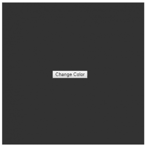
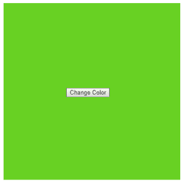
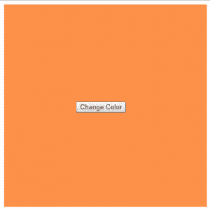

# p5.js | createButton()功能

> 原文:[https://www.geeksforgeeks.org/p5-js-createbutton-function/](https://www.geeksforgeeks.org/p5-js-createbutton-function/)

函数用于在文档对象模型中创建一个按钮元素。那个。size()函数用于设置按钮元素的大小。那个。mousePressed()函数用于指定鼠标按钮按下时的行为。
**注意:**这个函数需要 p5.dom 库。所以在**index.html**文件的头部增加下面一行。

```
<script src=
"https://cdnjs.cloudflare.com/ajax/libs/p5.js/0.5.11/addons/p5.dom.min.js">
</script>
```

**语法:**

```
createButton( label, value )
```

**参数:**该函数接受两个参数，如上所述，如下所述:

*   **标签:**该参数保持按钮上显示的标签。
*   **值:**该参数保存按钮的值。

**返回值:**返回一个指针元素，保存创建的节点对象。

**注意:**这个按钮元素可以链接鼠标按下、鼠标点击、鼠标释放等各种 JavaScript 事件。

**示例:**本示例使用 createButton()函数，使用 p5.js button 元素更改背景颜色。

```
// Create a variable for button object
var color_button;

// Create a function to change the background-color
function change_background() {

    // Pick a random number for r value
    r = random(255);

    // Pick a random number for g value
    g = random(255);

    // Pick a random number for b value
    b = random(255);

    // Set a random background-color
    background(r, g, b);
}

function setup() {

    // Create a canvas
    createCanvas(400, 400);

    // Set an initial background-color
    background(50);

    // Create the button
    color_button = createButton("Change Color");

    // Position the button
    color_button.position(150, 200);

    // When the button is clicked change_background()
    // function is called
    color_button.mouseClicked(change_background);
}
```

**输出:**

*   
*   **点击按钮后:**
    
*   **再次点击按钮后:**
    

**参考:**T2】https://p5js.org/reference/#/p5/createButton