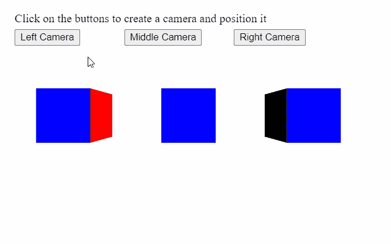

# p5.js | createCamera()函数

> 原文:[https://www.geeksforgeeks.org/p5-js-createcamera-function/](https://www.geeksforgeeks.org/p5-js-createcamera-function/)

p5.js 中的 **createCamera()函数**用于创建 p5。对象，并告诉渲染器将其用作当前摄像机。它返回新创建的相机对象。

**语法:**

```
createCamera()

```

**参数:**此功能不接受参数。
**返回值:**返回 p5。表示新创建的摄像机的摄像机对象。

下面的例子说明了 p5.js 中的 **createCamera()函数**:
**例子:**

## java 描述语言

```
let currCamera;

function setup() {
  createCanvas(500, 300, WEBGL);
  helpText = createP("Click on the buttons to create"+
                     "a camera and position it");
  helpText.position(20, 0);

  // Create three buttons for setting
  // a new camera for three directions
  newCameraBtn = createButton("Left Camera");
  newCameraBtn.position(20, 40);
  newCameraBtn.mouseClicked(createLeftCamera);

  newCameraBtn = createButton("Middle Camera");
  newCameraBtn.position(170, 40);
  newCameraBtn.mouseClicked(createMiddleCamera);

  newCameraBtn = createButton("Right Camera");
  newCameraBtn.position(320, 40);
  newCameraBtn.mouseClicked(createRightCamera);
}

function createLeftCamera() {
  // Create a new camera using createCamera()
  // and set its position
  currCamera = createCamera();
  currCamera.setPosition(-75, 0, 250);
}

function createMiddleCamera() {
  // Create a new camera using createCamera()
  // and set its position
  currCamera = createCamera();
  currCamera.setPosition(0, 0, 250);
}

function createRightCamera() {
  // Create a new camera using createCamera()
  // and set its position
  currCamera = createCamera();
  currCamera.setPosition(75, 0, 250);
}

function draw() {
  clear();
  orbitControl();
  normalMaterial();

  // Create three boxes at three positions
  translate(-150, 0);
  box(65);
  translate(150, 0);
  box(65);
  translate(150, 0);
  box(65);
}
```

**输出:**



**在线编辑:**[【https://editor.p5js.org/】](https://editor.p5js.org/)
**环境设置:**[https://www . geeksforgeeks . org/P5-js-soundfile-object-installation-and-methods/](https://www.geeksforgeeks.org/p5-js-soundfile-object-installation-and-methods/)
**参考:**[https://p5js.org/reference/#/p5/createCamera](https://p5js.org/reference/#/p5/createCamera)