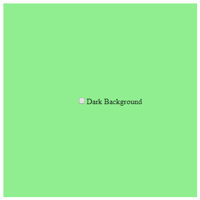
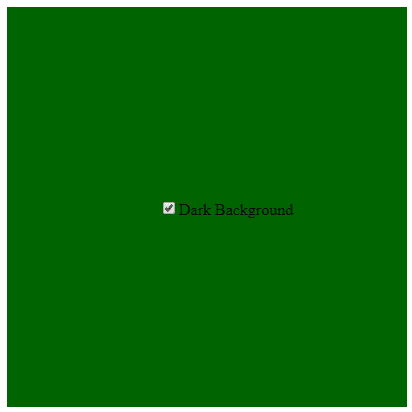

# p5.js | createCheckbox()函数

> 原文:[https://www . geesforgeks . org/P5-js-create checkbox-function/](https://www.geeksforgeeks.org/p5-js-createcheckbox-function/)

p5.js 中的 **createCheckbox()** 函数用于在 DOM(文档对象模型)中创建 Checkbox 元素。这个函数包括 p5.dom 库。在标题部分添加以下语法。

## 超文本标记语言

```
<script src=
"https://cdnjs.cloudflare.com/ajax/libs/p5.js/0.5.11/addons/p5.dom.min.js">
</script>
```

**语法:**

```
createCheckbox(label, value)
```

**参数:**

*   **标签:**该参数保持复选框旁边显示的标签。
*   **值:**该参数保持复选框的状态(真/假)。

**示例:**本示例使用复选框将背景颜色从浅变深，反之亦然。

## java 描述语言

```
// Create a variable for checkbox object
var checkbox;

// Create a function to change the background-color
function change_bg() {
    // Set dark color if box is checked
    if (this.checked()) {
        background("darkgreen");
    }
    // Set light color if box is unchecked
    else {
        background("lightgreen");
    }
}

function setup() {
    // Create a canvas
    createCanvas(400, 400);
    // Set the background-color
    background("lightgreen");
    // Create a checkbox object
    // Initially unchecked
    checkbox = createCheckbox('Dark Background', false);
    // Position the checkbox object
    checkbox.position(160, 200);
    // Call the change_bg() function when the box
    // is checked or unchecked
    checkbox.changed(change_bg);
}
```

**输出:**
**勾选框前:**



**勾选框后:**



**参考:**T2】https://p5js.org/reference/#/p5/createCheckbox