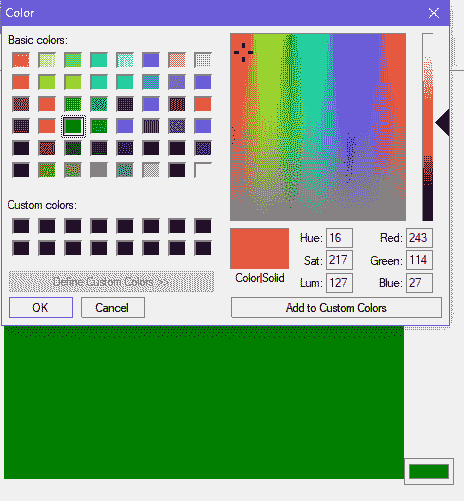
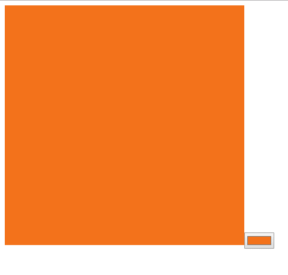

# p5.js | createColorPicker()函数

> 原文:[https://www . geesforgeks . org/P5-js-createcolorbucker-function/](https://www.geeksforgeeks.org/p5-js-createcolorpicker-function/)

p5.js 中的 **createColorPicker()** 函数用于在 DOM(文档对象模型)中创建一个颜色选择器元素，用于获取输入颜色。那个。color()方法用于获取当前选择的颜色。这个函数包括 p5.dom 库。在标题部分添加以下语法。

```
<script src=
"https://cdnjs.cloudflare.com/ajax/libs/p5.js/0.9.0/addons/p5.dom.min.js"> 
</script>
```

**语法:**

```
createColorPicker( value )
```

**参数:**该功能接受单参数**值**，该值保存拾色器的默认颜色。

**示例:**本示例使用拾色器对象来设置背景颜色。

```
// Create a variable for color-picker object
var color_picker;

function setup() {

    // Create a canvas
    createCanvas(400,400);

    // Create a color-picker object 
    color_picker = createColorPicker("green");
}

function draw() {

    // Set the background-color as
    // chosen by the color-picker
    background(color_picker.color());
}                    
```

**输出:**

*   **之前选择颜色:**
    
*   **从拾色器中选择颜色:**
    
*   **选择颜色后:**
    

**参考:**T2】https://p5js.org/reference/#/p5/createColorPicker