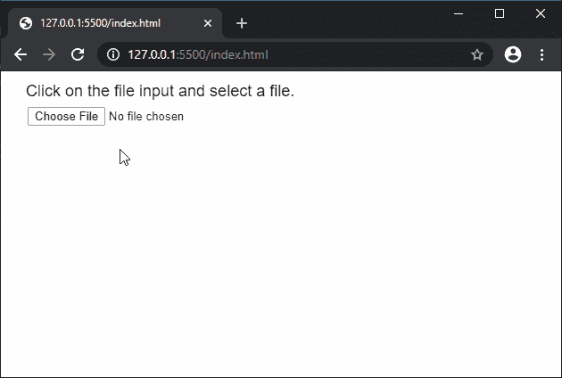
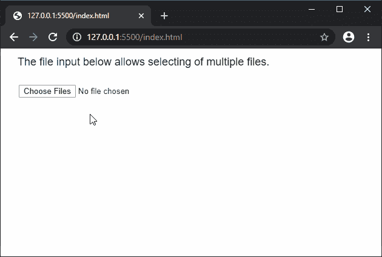

# p5.js | createFileInput()函数

> 原文:[https://www . geeksforgeeks . org/P5-js-createfile input-function/](https://www.geeksforgeeks.org/p5-js-createfileinput-function/)

**createFileInput()** 功能用于创建一个“文件”类型的输入元素，用户可以使用它来选择要在草图中使用的本地文件。如果需要，它还支持选择多个文件。

**语法:**

```
createFileInput(callback, multiple)
```

**参数:**该函数接受两个参数，如上所述，如下所述:

*   **回调:**是文件加载时会用到的回调函数。这是一个可选参数。
*   **multiple:** 是指定是否允许一次选择多个文件的字符串。可以设置为“真”或“假”。这是一个可选参数。

**返回值:**返回一个指向 p5 的指针。保存创建的文件对象的元素。

下面的例子说明了 p5.js 中的 **createFileInput()** 函数:

**示例 1:** 在本例中，我们将把一个文件作为输入。

```
function setup() {
  createCanvas(400, 200);

  textSize(18);
  text("Click on the file input and select a file.", 20, 20);

  inputbtn = createFileInput(processFile);
  inputbtn.position(30, 40);
}

function processFile(file) {
  console.log(file);
  text("The name of the file selected is: "+
                                file.name, 20, 80);
  text("The extension of the file selected is: "+ 
                               file.subtype, 20, 100);
  text("The type of the file selected is: "+
                                  file.type, 20, 120);
  text("The size of the file selected is: "+ 
                                  file.size, 20, 140);
}
```

**输出:**



**示例 2:** 在本例中，我们将多个文件作为输入。

```
let i = 0;

function setup() {
  createCanvas(500, 200);

  textSize(18);
  text("The file input below allows"+
          " selecting of multiple files.", 20, 20);

  inputBtn = createFileInput(processFiles, "true");
  inputBtn.position(30, 60);
}

function processFiles(file) {
  text("The name of the file selected is: " + 
                             file.name, 20, 120 + i);
  i = i + 20;
}
```

**输出:**



**在线编辑:**[https://editor.p5js.org/](https://editor.p5js.org/)

**环境设置:**

**参考:**T2】https://p5js.org/reference/#/p5/createFileInput