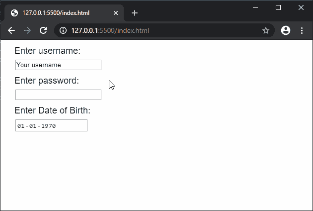
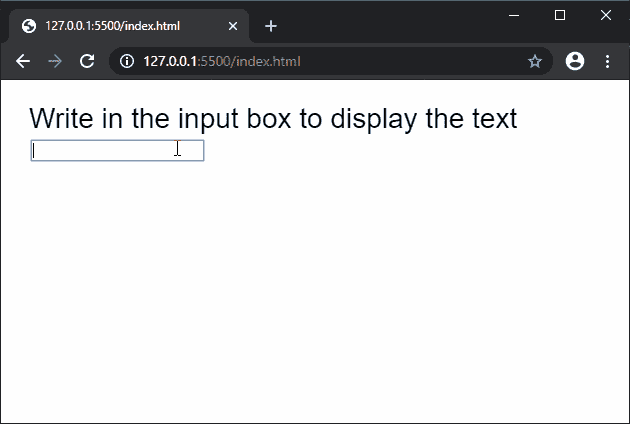

# p5.js | createInput()函数

> 原文:[https://www.geeksforgeeks.org/p5-js-createinput-function/](https://www.geeksforgeeks.org/p5-js-createinput-function/)

**createInput()** 函数用于在 DOM 中创建一个输入元素，用于接受文本输入。可选参数可用于设置可输入的输入类型。您可以使用 set()函数来定义框的长度。

**语法:**

```
createInput(value, type)
```

**参数:**该函数接受两个参数，如上所述，如下所述:

*   **值:**该字符串参数用于设置输入的默认值。
*   **类型:**这是一个设置输入类型的字符串参数。它可以有“文本”、“密码”等值，用于接受特定格式的文本。

**返回值:**返回一个指向 p5 的指针。具有创建的节点的元素。

下面的例子说明了 p5.js 中的 **createInput()** 函数:

**例 1:**

```
function setup() {
  createCanvas(300, 200);
  textSize(18);

  text("Enter username:", 20, 20);
  usernameInput = createInput('Your username', 'text');
  usernameInput.position(30, 40);

  text("Enter password:", 20, 80);
  passInput = createInput('', 'password');
  passInput.position(30, 100);

  text("Enter Date of Birth:", 20, 140); 
  dobInput = createInput('1970-01-01', 'date');
  dobInput.position(30, 160);
}
```

**输出:**



**例 2:**

```
function setup() {
  createCanvas(600, 300);
  textSize(28);
  text("Write in the input box to display the text", 20, 40);

  // Create input element
  let inputElem = createInput('');
  inputElem.input(onInput);
  inputElem.position(30, 60)
}

function onInput() {
  clear();
  text("Write in the input box to display the text", 20, 40);

  fill("green")
  strokeWeight(10)
  rect(0, 100, 600, 100)

  // Display the text entered
  fill("black")
  text(this.value(), 20, 140)
}
```

**输出:**



**在线编辑:**[https://editor.p5js.org/](https://editor.p5js.org/)

**环境设置:**

**参考:**T2】https://p5js.org/reference/#/p5/createInput