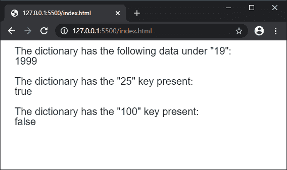
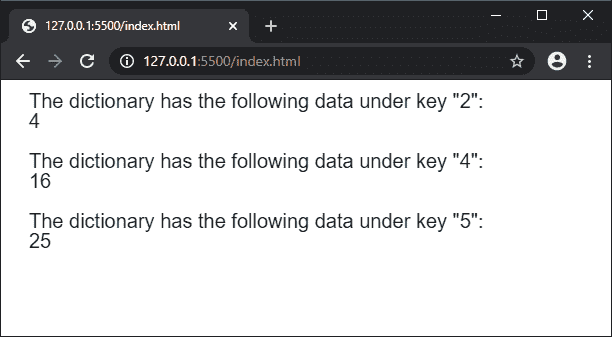

# p5.js | createNumberDict()函数

> 原文:[https://www . geesforgeks . org/P5-js-createnumberdict-function/](https://www.geeksforgeeks.org/p5-js-createnumberdict-function/)

**createNumberDict()函数**用于创建 p5。给定数据的 NumberDict 实例。数据可以通过键值对单独传递，也可以使用对象作为值的集合给出。

**语法:**

```
createNumberDict(key, value)
```

或者

```
createNumberDict(object)
```

**参数:**

*   **键:**指定字典中用作键的数字。
*   **值:**指定字典中用作值的数字。
*   **对象:**指定用作字典的对象。

**返回值:**返回 **p5。NumberDict** 给定数据的对象。

下面的程序说明了 p5.js 中的 **createNumberDict()函数**:

**例 1:**

```
function setup() {
  createCanvas(500, 200);
  textSize(20);

  // Creating a number dictionary
  // with the given key and value pair
  let mydict = createNumberDict("19", "1999");

  // Accessing the data using the data property
  text('The dictionary has the following data under "19":', 20, 20);
  text(mydict.data["19"], 20, 40);

  // Checking if a key exists in the dictionary
  text('The dictionary has the "25" key present:', 20, 80);
  text(mydict.hasKey("19"), 20, 100);

  text('The dictionary has the "100" key present:', 20, 140);
  text(mydict.hasKey("100"), 20, 160);
}
```

**输出:**


**例 2:**

```
function setup() {
  createCanvas(600, 200);
  textSize(20);

  let squaresObject = {
    2: 4,
    3: 9,
    4: 16,
    5: 25
  }

  // Creating a number dictionary
  // with the above object
  let mydict = createNumberDict(squaresObject);

  // Accessing the data using the data property
  text('The dictionary has the following data under key "2":', 20, 20);
  text(mydict.data["2"], 20, 40);

  text('The dictionary has the following data under key "4":', 20, 80);
  text(mydict.data["4"], 20, 100);

  text('The dictionary has the following data under key "5":', 20, 140);
  text(mydict.data["5"], 20, 160);
}
```

**输出:**


**在线编辑:**[https://editor.p5js.org/](https://editor.p5js.org/)

**环境设置:**

**参考:**T2】https://p5js.org/reference/#/p5/createNumberDict