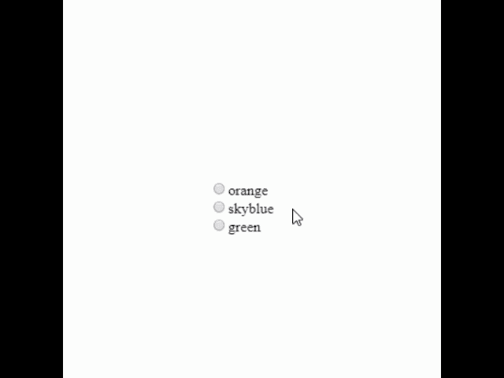

# p5.js | createRadio()函数

> 原文:[https://www.geeksforgeeks.org/p5-js-createradio-function/](https://www.geeksforgeeks.org/p5-js-createradio-function/)

**createRadio()** 函数用于在 DOM(文档对象模型)中创建单选按钮元素。那个。option()方法用于设置收音机的选项。
此功能需要 p5.dom 库。因此，在 index.html 文件的头部添加下面一行。

## 超文本标记语言

```
<script src=
"https://cdnjs.cloudflare.com/ajax/libs/p5.js/0.5.11/addons/p5.dom.min.js">
</script>
```

**语法:**

```
createRadio( divId )
```

**参数:**该函数接受单个参数**divIde**，分别保存创建的 div 和输入字段的 id 和名称。
**示例:**本示例根据单选按钮的选定选项更改背景颜色。

## java 描述语言

```
// Create a variable for radio-button object
var radio;

function setup() {

    // Create a canvas
    createCanvas(400, 400);

    // Create a radio-button object
    // and set options
    radio = createRadio();

    // Option 1 : orange
    radio.option('orange');

    // Option 2 : skyblue
    radio.option('skyblue');

    // Option 3 : green
    radio.option('green');

    // Set the width
    radio.style("width", "80px");

    // Position the radio-button object
    radio.position(160, 200);
}

function draw() {

    // Get the value of the radio-button
    var val = radio.value();

    // Set the background-color
    background(val);
}
```

**输出:**



**参考:**T2】https://p5js.org/reference/#/p5/createRadio