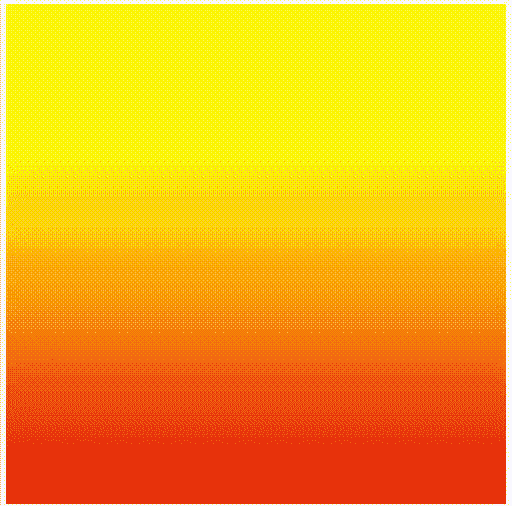

# P5 . js create hader()方法

> 原文:[https://www.geeksforgeeks.org/p5-js-createshader-method/](https://www.geeksforgeeks.org/p5-js-createshader-method/)

函数**创建从字符串加载着色器的着色器()**。它是在函数设置中调用的。在代码中将着色器编写为字符串的最简单方法可能是使用 javascripts 模板字符串语法。

语法:

```
createShader(vertSrc, fragSrc)
```

参数:

**vertSrc :** 它是字符串类型，是顶点着色器的源代码。

**片段着色器**:字符串类型，片段着色器的源代码。

**返回:**

```
 A shader object created from the provided vertex and fragment shaders.
```

示例:

**显示日落颜色的着色器。**

## java 描述语言

```
let theShader;

function setup() {
    createCanvas(400, 400, WEBGL);
    background(0);
    noStroke();

    // load vert/frag defined below
    theShader = createShader(vertShader, fragShader);
}

function draw() {
    theShader.setUniform('u_resolution', [width, height]);
    theShader.setUniform('u_time', frameCount*.01);

    // set + display shader
    shader(theShader); // apply shader

    rect(0, 0, 400, 400);
}

// the vertex shader is called for each vertex

let vertShader = `
    //standard vertex shader
    attribute vec3 aPosition;

    void main() {
      // Copy the position data into a vec4, adding 1.0 as the w parameter
      vec4 positionVec4 = vec4(aPosition, 1.0);

      // Scale to make the output fit the canvas
      positionVec4.xy = positionVec4.xy * 2.0 - 1.0;

      // Send the vertex information on to the fragment shader
      gl_Position = positionVec4;
    }`;

// the fragment shader is called for each pixel

let fragShader = `
    #ifdef GL_ES
    precision mediump float;
    #endif

uniform vec2 u_resolution;
uniform vec2 u_mouse;
uniform float u_time;

vec3 colorA = vec3(0.905,0.045,0.045);
vec3 colorB = vec3(0.995,0.705,0.051);

    void main() {

     vec2 st = gl_FragCoord.xy/u_resolution.xy;

    float sinF = sin(u_time) * 0.5 + 0.5;

    vec3 colorTop = mix(colorA, colorB, sinF);
    vec3 colorBottom = mix(colorB, colorA, sinF);

    vec3 pct = vec3(st.y);

    vec3 color = vec3(0.0);

    color = mix(colorTop, colorBottom, pct);

    gl_FragColor = vec4(color,1);

    }`;
```

**输出**:

