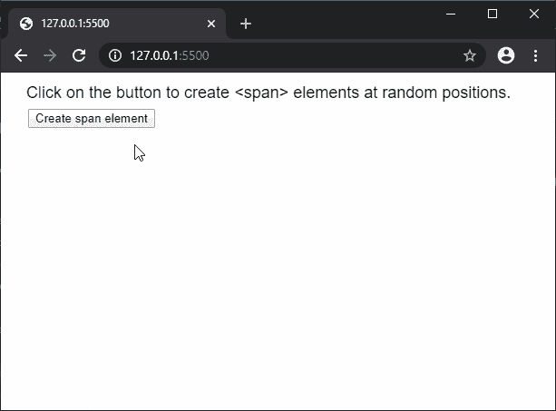

# p5.js | createSpan()函数

> 原文:[https://www.geeksforgeeks.org/p5-js-createspan-function/](https://www.geeksforgeeks.org/p5-js-createspan-function/)

**createSpan()** 函数用于使用给定的可选内部 html 在 DOM 中创建一个 Span 元素。

**语法:**

```
createSpan([html])
```

**参数:**该函数接受如上所述的单个参数，如下所述:

*   **html:** 是一个带有 span 元素的 innerHTML 的字符串。这是一个可选参数。

**返回值:**返回一个指向 p5 的指针。具有创建的节点的元素。

下面的例子说明了 p5.js 中的 **createSpan()** 函数:

**示例:**

```
function setup() {
  createCanvas(600, 300);

  textSize(18);
  text("Click on the button to create" +
       "<span> elements at random positions.", 20, 20)
  genBtn = createButton("Create span element").position(30, 40);
  genBtn.mousePressed(spawnSpan);
}

function spawnSpan() {
  newSpan = createSpan("This is a <b>span</b> element"+
                       " with custom <i>innerHTML</i>.");
  newSpan.position(random(50, 500), random(50, 300));
}
```

**输出:**


**在线编辑:**[https://editor.p5js.org/](https://editor.p5js.org/)

**环境设置:**

**参考:**T2】https://p5js.org/reference/#/p5/createSpan