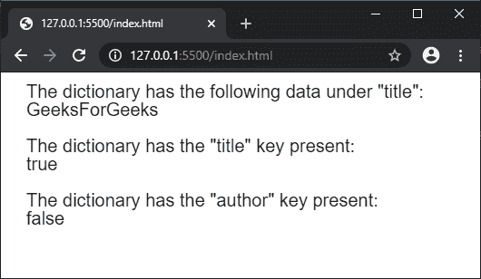

# p5.js | createStringDict()函数

> 原文:[https://www . geesforgeks . org/P5-js-createstringdict-function/](https://www.geeksforgeeks.org/p5-js-createstringdict-function/)

**createStringDict()函数**用于创建 p5。带有给定数据的 StringDict 实例。数据可以作为键值对单独传递，也可以使用对象作为值的集合给出。

**语法:**

```
createStringDict(key, value)
```

或者

```
createStringDict(object)
```

**参数:**

*   **键:**指定字典中用作键的字符串。
*   **值:**指定字典中用作值的字符串。
*   **对象:**指定用作字典的对象。

**返回值:**返回 **p5。给定数据的 string ditc**对象。
下面的程序说明了 p5.js:
**例 1:** 中的 **createStringDict()函数**

## java 描述语言

```
function setup() {
  createCanvas(500, 200);
  textSize(20);

  // Creating a string dictionary
  // with the given key and value pair
  let mydict = createStringDict("title", "GeeksForGeeks");

  // Accessing the data using the data property
  text('The dictionary has the following data under "title":', 20, 20);
  text(mydict.data.title, 20, 40);

  // Checking if a key exists in the dictionary
  text('The dictionary has the "title" key present:', 20, 80);
  text(mydict.hasKey("title"), 20, 100);

  text('The dictionary has the "author" key present:', 20, 140);
  text(mydict.hasKey("author"), 20, 160);
}
```

**输出:**



**例 2:**

## java 描述语言

```
function setup() {
  createCanvas(600, 200);
  textSize(20);

  let obj = {
    book: "Let Us C",
    author: "Yashavant Kanetkar",
    language: "English"
  }

  // Creating a string dictionary
  // with the above object
  let mydict = createStringDict(obj);

  // Accessing the data using the data property
  text('The dictionary has the following data under "title":', 20, 20);
  text(mydict.data.book, 20, 40);

  text('The dictionary has the following data under "author":', 20, 80);
  text(mydict.data.author, 20, 100);

  text('The dictionary has the following data under "language":', 20, 140);
  text(mydict.data.language, 20, 160);
}
```

**输出:**


**在线编辑:**[【https://editor.p5js.org/】](https://editor.p5js.org/)
**环境设置:**[https://www . geeksforgeeks . org/P5-js-soundfile-object-installation-and-methods/](https://www.geeksforgeeks.org/p5-js-soundfile-object-installation-and-methods/)
**参考:**[https://p5js.org/reference/#/p5/createStringDict](https://p5js.org/reference/#/p5/createStringDict)