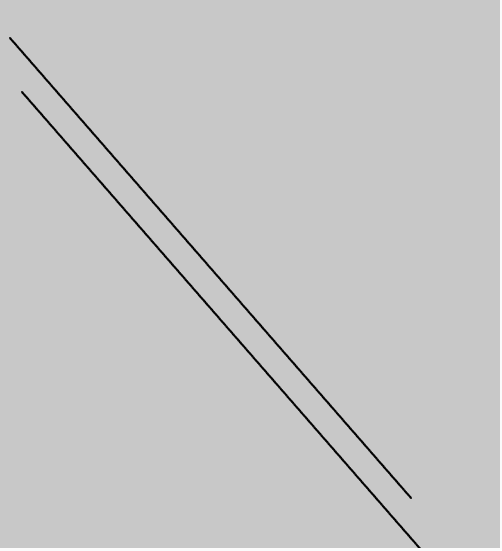
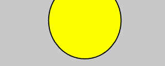

# p5.js | createVector()函数

> 原文:[https://www.geeksforgeeks.org/p5-js-createvector-function/](https://www.geeksforgeeks.org/p5-js-createvector-function/)

p5.js 中的 **createVector()函数**用于创建新的 p5 向量，该向量包含大小和方向。这提供了二维或三维向量，特别是几何向量。

**语法:**

```
createVector([x], [y], [z])
```

**参数:**该功能接受三个参数，如上所述，描述如下:

*   **x:** 此参数存储向量的 x 分量。
*   **y:** 此参数存储向量的 y 分量。
*   **z:** 该参数存储矢量的 z 分量。

下面的程序说明了 p5.js 中的 createVector()函数:

**示例 1:** 本示例使用 createVector()函数绘制一条线。

## java 描述语言

```
function setup() {

    // Create a Canvas
    createCanvas(500, 550);
}

function draw() {

    // Vector initialisation
    // using createVector
    t1 = createVector(10, 40);
    t2 = createVector(411, 500);

    // Set background color 
    background(200);

    // Set stroke weight
    strokeWeight(2);

    // line using vector
    line(t1.x, t1.y, t2.x, t2.y);

    translate(12, 54);

    line(t1.x, t1.y, t2.x, t2.y);
}
```

**输出:**



**示例 2:** 本示例使用 createVector()函数绘制圆。

## java 描述语言

```
function setup() {

    // Create a Canvas
    createCanvas(500, 550);
}

function draw() {

    // Vector initialisation
    // using createVector
    t1 = createVector(10, 40);
    t2 = createVector(41, 50);

    // Set background color 
    background(200);

    // Set stroke weight
    strokeWeight(2);

    // Fill yellow
    fill('yellow');

    // ellipse using vector
    ellipse(t1.x*millis() / 1000 * 20,
            t1.y, t2.x+100, t2.y+100);
}
```

**输出:**



**参考:**T2https://p5js.org/reference/#/p5/createVector