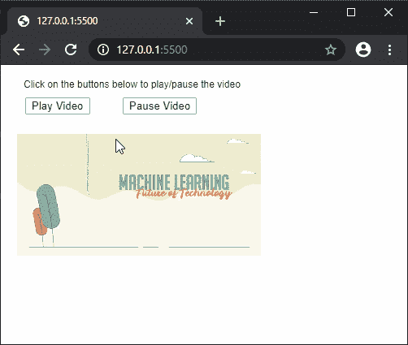
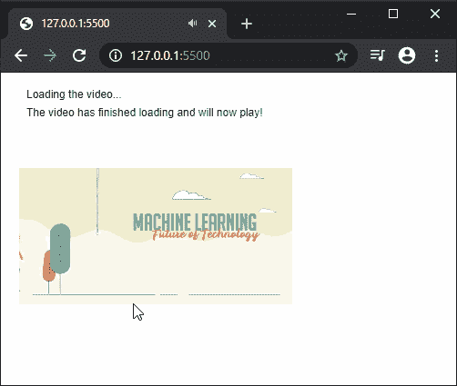

# p5.js | createVideo()函数

> 原文:[https://www.geeksforgeeks.org/p5-js-createvideo-function/](https://www.geeksforgeeks.org/p5-js-createvideo-function/)

**createVideo()** 函数用于在 DOM 中创建一个视频元素。视频被创建为 p5。MediaElement，它有控制媒体及其播放的方法。

**语法:**

```
createVideo(src, callback)
```

**参数:**该函数接受两个参数，如上所述，如下所述:

*   **src:** 是指定视频文件路径的字符串。字符串数组也可以用来指定支持不同浏览器的多个路径。
*   **回调:**这是一个回调函数，当**【无法通过】**事件触发时会被触发。当视频完成加载且不需要任何额外缓冲时，将触发此事件。这是一个可选参数。

**返回值:**返回一个指向 p5 的指针。视频的 MediaElement。

下面的例子说明了 p5.js 中的 **createVideo()** 函数:

**例 1:**

```
function setup() {
  createCanvas(300, 300);
  text("Click on the buttons below to"+
       " play/pause the video", 20, 20);

  vidElement = createVideo("sample_video.mp4");
  vidElement.position(20, 0);
  vidElement.size(300);

  playBtn = createButton("Play Video");
  playBtn.position(30, 40);
  playBtn.mouseClicked(playVideo);

  pauseBtn = createButton("Pause Video");
  pauseBtn.position(150, 40);
  pauseBtn.mouseClicked(pauseVideo);
}

function playVideo() {
  vidElement.play();
}

function pauseVideo() {
  vidElement.pause();
}
```

**输出:**


**例 2:**

```
function setup() {
  createCanvas(300, 300);
  text("Loading the video...", 20, 20);

  vidElement = createVideo("sample_video.mp4", afterLoad);
  vidElement.position(20, 20);
  vidElement.size(300);
}

function afterLoad() {
  text("The video has finished loading and will"+
                           " now play!", 20, 40);
  vidElement.play();
}
```

**输出:**



**在线编辑:**[https://editor.p5js.org/](https://editor.p5js.org/)

**环境设置:**

**参考:**T2】https://p5js.org/reference/#/p5/createVideo