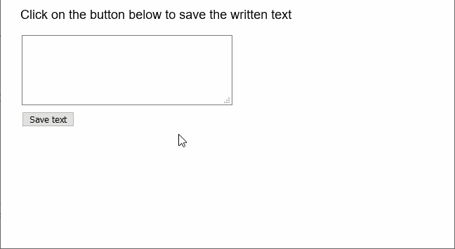
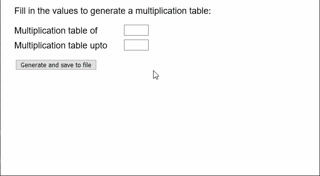

# p5.js | createWriter()函数

> 原文:[https://www.geeksforgeeks.org/p5-js-createwriter-function/](https://www.geeksforgeeks.org/p5-js-createwriter-function/)

p5.js 中的 **createWriter()函数**用于创建 p5。PrintWriter 对象，可用于写入或打印各种可用的流。

**语法:**

```
createWriter( name, [extension] )
```

**参数:**该函数接受两个参数，如上所述，如下所述。

*   **名称:**是表示要创建的文件名称的字符串。
*   **扩展名:**是指定文件扩展名的字符串。这是一个可选参数。

**返回值:**返回 p5。表示编写器的 PrintWriter 对象。

下面的例子说明了 p5.js 中的 **createWriter()函数**:

**例 1:**

```
let fwriter;

function setup() {
  createCanvas(600, 300);
  textSize(18);

  // Create a textarea for the input of text
  inputArea = createElement("textarea");
  inputArea.position(30, 50);
  inputArea.size(300, 100);

  // Create a button for saving text
  saveBtn = createButton("Save text");
  saveBtn.position(30, 160);
  saveBtn.mousePressed(saveFile);

  // Setup the writer
  fwriter = createWriter("note.txt");

  text("Click on the button below to save the written text", 20, 20);
}

function saveFile() {
  // Get the value of the textarea
  // and split the strings on the basis
  // of the nextline character
  stringList = inputArea.value().split("\n");

  // Save the strings to file
  for (line of stringList) {
    fwriter.print(line);
  }

  // Close the writer
  fwriter.close();

  // Clear the writer
  fwriter.clear();
}
```

**输出:**



**例 2:**

```
function setup() {
  createCanvas(600, 300);
  textSize(18);

  // Create two inputs for the
  // multiplication table
  multiOf = createInput();
  multiOf.position(250, 50);
  multiOf.size(50);

  multiTo = createInput();
  multiTo.position(250, 80);
  multiTo.size(50);

  // Create a button for saving text
  saveBtn = createButton("Generate and save to file");
  saveBtn.position(30, 120);
  saveBtn.mousePressed(saveFile);

  // Setup the writer
  fwriter = createWriter("tables.txt");
}

function draw() {
  clear();
  text("Fill in the values to generate a multiplication table:", 20, 20);
  text("Multiplication table of", 20, 60);
  text("Multiplication table upto", 20, 90);
}

function saveFile() {
  // Get the value of the two inputs
  // and generate table
  let multipicand = multiOf.value();
  let multiMax = multiTo.value();

  for (let multiplier = 1; multiplier <= multiMax; multiplier++) {
    let textToWrite =
      multipicand + " * " + multiplier + " = " + multipicand * multiplier;

    // Print to the writer
    fwriter.print(textToWrite);
  }

  // Close the writer
  fwriter.close();

  // Clear the writer
  fwriter.clear();
}
```

**输出:**



**在线编辑:**[https://editor.p5js.org/](https://editor.p5js.org/)

**环境设置:**

**参考:**T2】https://p5js.org/reference/#/p5/createWriter