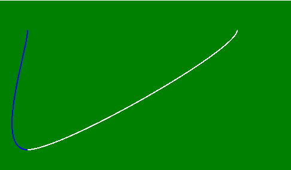
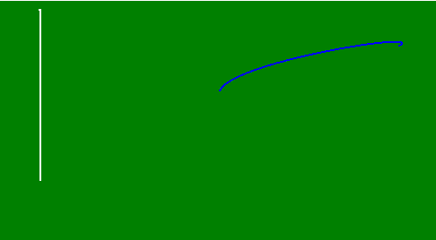

# p5.js | curve()功能

> 原文:[https://www.geeksforgeeks.org/p5-js-curve-function/](https://www.geeksforgeeks.org/p5-js-curve-function/)

**曲线()功能**用于在屏幕中间四个参数给定的两点之间画一条曲线。前两个和后两个参数用作控制点。

**语法:**

```
curve( x1, y1, x2, y2, x3, y3, x4, y4 )
```

或者

```
curve( x1, y1, z1, x2, y2, z2, x3, y3, z3, x4, y4, z4 )
```

**参数:**

| 价值 | 描述 |
| x1 | 用于保存起始控制点的 x 坐标。 |
| y1 | 用于保存开始控制点的 y 坐标。 |
| z1 | 用于保存开始控制点的 z 坐标。 |
| x2 | 用于保存第一点的 x 坐标。 |
| y2 | 用于保存第一点的 y 坐标。 |
| z2 | 用于保存第一点的 z 坐标。 |
| x3 | 它用于保存第二个点的 x 坐标。 |
| y3 | 它用于保存第二个点的 y 坐标。 |
| z3 | 它用于保存第二个点的 z 坐标。 |
| x4 | 用于保存终点控制点的 x 坐标。 |
| y4 | 用于保存终点控制点的 y 坐标。 |
| z4 | 用于保存终点控制点的 z 坐标。 |

下面的例子说明了 CSS 中的 curve()函数:

**Example 1:**

```
function setup() { 

    // Create canvas of given size
    createCanvas(500, 300); 

    // Set the background of canvas
    background('green'); 
} 

function draw() { 

    // Use noFill() function to not fill the color
    noFill();

    // Set the stroke color
    stroke('white');

    // Use curve() function to create curve
    curve(50, 50, 400, 50, 50, 250, 50, 50);

    // Set the stroke color
    stroke('blue');

    // Use curve() function to create curve
    curve(400, 50, 50, 250, 50, 50, 50, 50); 
} 
```

**输出:**


**Example 2:**

```
function setup() { 

    // Create canvas of given size
    createCanvas(500, 300); 

    // Set the background of canvas
    background('green'); 
} 

function draw() { 

    // Use noFill() function to not fill the color
    noFill();

    // Set the stroke color
    stroke('white');

    // Use curve() function to create curve
    curve(50, 50, 50, 200, 50, 10, 50, 250, 150, 50, 50, 50);

    // Set the stroke color
    stroke('blue');

    // Use curve() function to create curve
    curve(50, 200, 450, 50, 250, 100, 350, 250, 250, 450, 450, 400); 
} 
```

**输出:**


**在线编辑:**[【https://editor.p5js.org/】](https://editor.p5js.org/)
**环境设置:**[https://www . geeksforgeeks . org/P5-js-soundfile-object-installation-and-methods/](https://www.geeksforgeeks.org/p5-js-soundfile-object-installation-and-methods/)