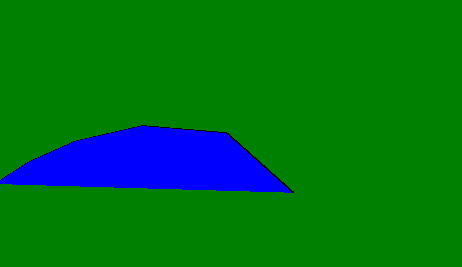

# p5.js | curveDetail()功能

> 原文:[https://www.geeksforgeeks.org/p5-js-curvedetail-function/](https://www.geeksforgeeks.org/p5-js-curvedetail-function/)

**曲线尾部()功能**用于设置曲线显示的分辨率。当使用 WEBGL 渲染器时，此功能非常有用，因为默认画布渲染器不使用此信息。

**语法:**

```
curveDetail( resolution )
```

**参数:**该功能接受保存分辨率值的单参数**分辨率**。该参数的默认值为 20，最小值为 3。

下面的例子说明了 p5.js 中的 curveDetail()函数:

**示例:**

```
function setup() { 

    // Create canvas of given size
    createCanvas(500, 300, WEBGL); 

    // Set the background of canvas
    background('green');

    // Use curveDetail() function
    curveDetail(5)
} 

function draw() { 

    // Fill the color
    fill('blue');

    // Draw the curve
    curve(50, 200, 400, -250, 40, 0, 30, 30, 100, -50, 600, 50);
} 
```

**输出:**


**在线编辑:**[【https://editor.p5js.org/】](https://editor.p5js.org/)
**环境设置:**[https://www . geeksforgeeks . org/P5-js-soundfile-object-installation-and-methods/](https://www.geeksforgeeks.org/p5-js-soundfile-object-installation-and-methods/)