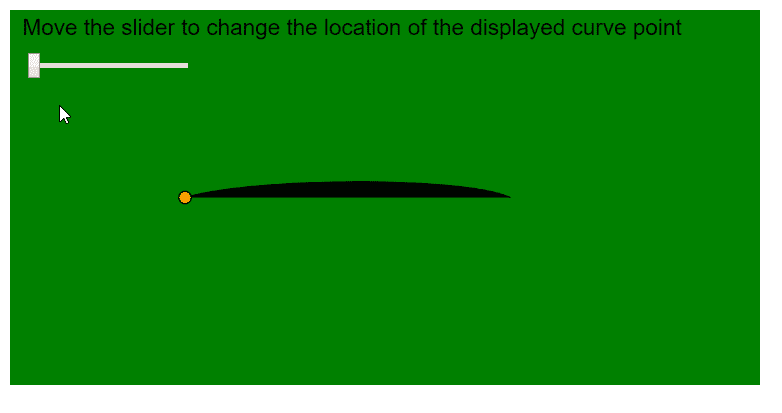
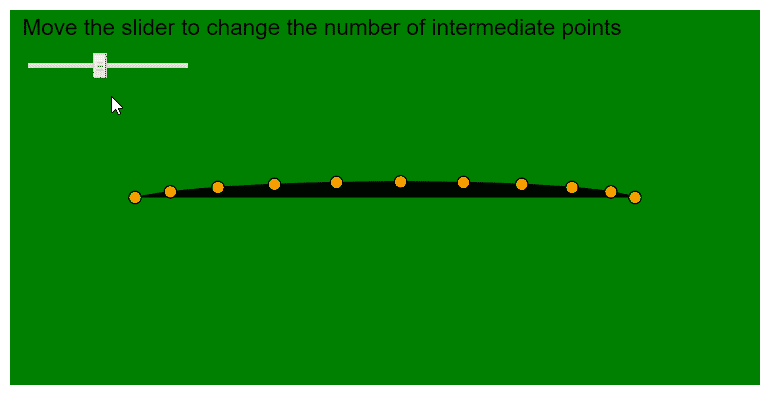

# p5.js | curvePoint()函数

> 原文:[https://www.geeksforgeeks.org/p5-js-curvepoint-function/](https://www.geeksforgeeks.org/p5-js-curvepoint-function/)

p5.js 中的 **curvePoint()函数**用于计算给定点处曲线的坐标。它获取特定轴的曲线坐标，并在点“t”处找到曲线坐标，该点可以指定为参数。

曲线中一点的完整位置可以通过在曲线的 x 坐标和 y 坐标上使用函数一次找到然后一起使用来找到。

**语法:**

```
curvePoint( a, b, c, d, t )
```

**参数:**该功能接受五个参数，如上所述，描述如下:

*   **a:** 是指定曲线第一点的数字。
*   **b:** 是指定曲线第一个控制点的数字。
*   **c:** 是指定曲线第二个控制点的数字。
*   **d:** 是指定曲线第二点的数字。
*   **t:** 是一个 0 到 1 之间的数字，用作曲线坐标开始和结束之间的位置。

**返回值:**返回一个指定给定位置曲线值的数字。

下面的例子说明了 p5.js 中的**曲线点()函数**:

**例 1:**

```
function setup() {
  createCanvas(600, 300);
  textSize(18);

  curvePointLocationSlider = createSlider(0, 1, 0, 0.1);
  curvePointLocationSlider.position(20, 40);
}

function draw() {
  background("green");
  fill("black");
  text(
    "Move the slider to change the location of the displayed curve point",
    10, 20
  );

  // Get the required location of curve
  curvePointLocationValue = curvePointLocationSlider.value();

  let p1 = { x: 50, y: 250 };
  let p2 = { x: 140, y: 150 };
  let p3 = { x: 400, y: 150 };
  let p4 = { x: 350, y: 250 };

  // Draw curve using curveVertex()
  beginShape();
  curveVertex(p1.x, p1.y);
  curveVertex(p2.x, p2.y);
  curveVertex(p3.x, p3.y);
  curveVertex(p4.x, p4.y);
  endShape();

  // Find the X and Y coordinate using the curvePoint() function
  let pointX = curvePoint(p1.x, p2.x, p3.x, p4.x, curvePointLocationValue);
  let pointY = curvePoint(p1.y, p2.y, p3.y, p4.y, curvePointLocationValue);
  fill("orange");

  // Display a circle at that point
  circle(pointX, pointY, 10);
}
```

**输出:**



**例 2:**

```
function setup() {
  createCanvas(600, 300);
  textSize(18);

  maxPointsSlider = createSlider(2, 20, 10, 1);
  maxPointsSlider.position(20, 40);
}

function draw() {
  background("green");
  fill("black");
  text("Move the slider to change the number of intermediate points", 10, 20);

  // Get the required location of curve
  maxPoints = maxPointsSlider.value();

  let p1 = { x: 50, y: 250 };
  let p2 = { x: 100, y: 150 };
  let p3 = { x: 500, y: 150 };
  let p4 = { x: 350, y: 250 };

  // Draw curve using curveVertex()
  beginShape();
  curveVertex(p1.x, p1.y);
  curveVertex(p2.x, p2.y);
  curveVertex(p3.x, p3.y);
  curveVertex(p4.x, p4.y);
  endShape();

  for (let i = 0; i <= maxPoints; i++) {
    // Calculate step using the maximum number of points
    let step = i / maxPoints;

    // Find the X and Y coordinate using the curvePoint() function
    let pointX = curvePoint(p1.x, p2.x, p3.x, p4.x, step);
    let pointY = curvePoint(p1.y, p2.y, p3.y, p4.y, step);
    fill("orange");

    // Display a circle at that point
    circle(pointX, pointY, 10);
  }
}
```

**输出:**



**在线编辑:**[https://editor.p5js.org/](https://editor.p5js.org/)

**环境设置:**

**参考:**T2】https://p5js.org/reference/#/p5/curvePoint