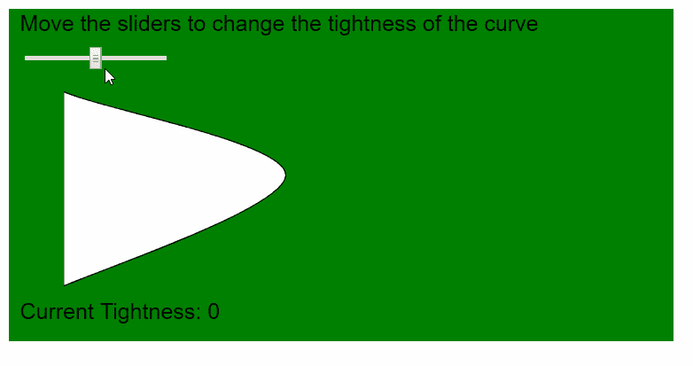
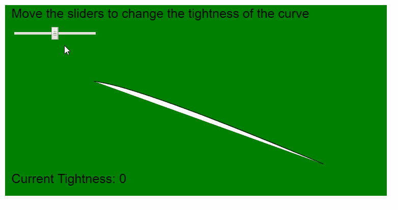

# p5.js |曲率()函数

> 原文:[https://www . geeksforgeeks . org/P5-js-curveticity-function/](https://www.geeksforgeeks.org/p5-js-curvetightness-function/)

p5.js 中的**曲率()函数**用于修改使用 curveVertex()和 curve vertex()函数创建的曲线的质量。紧密度参数用于定义曲线如何拟合其顶点。曲线的松紧度默认值为 0.0，值 1.0 用直线连接所有的点。
紧密度值的范围可以从-5.0 到 5.0，值越高曲线变形越多，同时仍然保持它们的可识别性。
**语法:**

```
curveTightness( amount )

```

**参数:**该功能接受一个参数，如上所述，描述如下:

*   **量:**是一个数字，指定曲线从其原始顶点变形的量。该值的范围从-5.0 到 5.0。

下面的例子说明了 p5.js 中的**曲线点()函数**:

**例 1:**

## java 描述语言

```
function setup() {
  createCanvas(600, 300);
  textSize(20);

  tightnessSlider = createSlider(-5, 5, 0, 0.1);
  tightnessSlider.position(20, 40);
}

function draw() {
  background("green");
  text("Move the sliders to change the tightness of the curve", 10, 20);

  // Get the tightness value
  tightnessValue = tightnessSlider.value();

  // Set the tightness value
  curveTightness(tightnessValue);

  // Draw curve using curveVertex()
  beginShape();
  curveVertex(20, 50);
  curveVertex(50, 75);
  curveVertex(250, 150);
  curveVertex(50, 250);
  curveVertex(20, 250);
  endShape();

  text("Current Tightness: " + tightnessValue, 10, 280);
}
```

**输出:**



**例 2:**

## java 描述语言

```
function setup() {
  createCanvas(600, 300);
  textSize(20);

  tightnessSlider = createSlider(-5, 5, 0, 0.1);
  tightnessSlider.position(20, 40);
}

function draw() {
  background("green");
  text("Move the sliders to change the tightness of the curve", 10, 20);

  // Get the tightness value
  tightnessValue = tightnessSlider.value();

  // Set the tightness value
  curveTightness(tightnessValue);

  // Draw curve using curve()
  curve(60, 200, 140, 120, 500, 250, 450, 250);

  text("Current Tightness: " + tightnessValue, 10, 280);
}
```

**输出:**



**在线编辑:**[【https://editor.p5js.org/】](https://editor.p5js.org/)
**环境设置:**[https://www . geeksforgeeks . org/P5-js-soundfile-object-installation-and-methods/](https://www.geeksforgeeks.org/p5-js-soundfile-object-installation-and-methods/)
**参考:**[https://p5js.org/reference/#/p5/curveTightness](https://p5js.org/reference/#/p5/curveTightness)