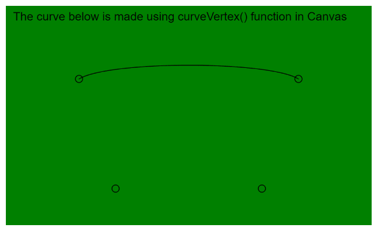
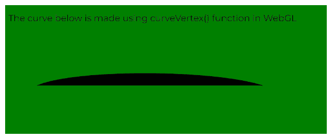

# p5.js | curveVertex()函数

> 原文:[https://www.geeksforgeeks.org/p5-js-curvevertex-function/](https://www.geeksforgeeks.org/p5-js-curvevertex-function/)

p5.js 中的 **curveVertex()函数**用于指定绘制曲线所用的顶点坐标。2D 曲线需要 2 个参数，三维曲线需要 3 个参数。2D 模式和 3D 模式都可以用于在 WebGL 模式下绘图。该功能只能在 **beginShape()** 和 **endShape()** 之间使用。

第一个和最后一个顶点用于引导曲线的起点和终点。在给定的第二点和第三点之间绘制曲线至少需要四个点。额外的顶点将用于绘制它们之间的曲线。

**语法:**

```
curveVertex( x, y )
```

运筹学

```
curveVertex( x, y, [z] )
```

**参数:**该功能接受三个参数，如上所述，描述如下:

*   **x:** 是指定顶点 x 坐标的数字。
*   **y:** 是指定顶点 y 坐标的数字。
*   **z:** 是指定顶点 z 坐标的数字。这是一个可选参数。

下面的例子说明了 p5.js 中的 **curveVertex()函数**:

**例 1:**

```
function setup() {
  createCanvas(500, 300);
  textSize(16);
}

function draw() {
  background("green");
  fill("black");
  text("The curve below is made using curveVertex() function in Canvas", 10, 20);

  // Define the vertex points
  let p1 = { x: 150, y: 250 };
  let p2 = { x: 100, y: 100 };
  let p3 = { x: 400, y: 100 };
  let p4 = { x: 350, y: 250 };

  noFill();

  // Start the curve
  beginShape();

  // Specify other points in curveVertex()
  curveVertex(p1.x, p1.y);
  curveVertex(p2.x, p2.y);
  curveVertex(p3.x, p3.y);
  curveVertex(p4.x, p4.y);
  endShape();

  // Draw circles for demonstration
  circle(p1.x, p1.y, 10);
  circle(p2.x, p2.y, 10);
  circle(p3.x, p3.y, 10);
  circle(p4.x, p4.y, 10);
}
```

**输出:**



**例 2:**

```
let newFont;

function preload() {
  newFont = loadFont("fonts/Montserrat.otf");
}

function setup() {
  createCanvas(500, 200, WEBGL);
  textFont(newFont, 14);
}

function draw() {
  background("green");
  fill("black");
  text("The curve below is made using curveVertex() function in WebGL", -245, -75);

  // Define the vertex points
  let p1 = { x: -200, y: 175, z: 0 };
  let p2 = { x: -200, y: 25, z: 0 };
  let p3 = { x: 150, y: 25, z: 0 };
  let p4 = { x: 275, y: 175, z: 0 };

  noFill();

  // Start the curve
  beginShape();

  // Specify the points of the vertex
  curveVertex(p1.x, p1.y, p1.z);
  curveVertex(p2.x, p2.y, p2.z);
  curveVertex(p3.x, p3.y, p3.z);
  curveVertex(p4.x, p4.y, p4.z);
  endShape();
}
```

**输出:**



**在线编辑:**[https://editor.p5js.org/](https://editor.p5js.org/)

**环境设置:**

**参考:**T2】https://p5js.org/reference/#/p5/curveVertex