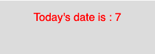

# p5.js | day()功能

> 原文:[https://www.geeksforgeeks.org/p5-js-day-function/](https://www.geeksforgeeks.org/p5-js-day-function/)

p5.js 中的 **day()功能**用于从系统时钟中获取当前日期。它返回 1 到 31 之间的值。

**语法:**

```
day()
```

**参数:**函数不接受任何参数。

**返回值:**返回代表当前日期的整数值。

下面的程序说明了 p5.js 中的 day()函数:

**示例:**本示例使用 day()函数从系统时钟获取当前日期。

```
function setup() {

    // Create Canvas of size 270*80
    createCanvas(270, 80);
}

function draw() {

    // Set the background color
    background(220);

    // Initialize the parameter with day
    let d = day();

    // Set the size of text
    textSize(16);

    // Set the text color
    fill(color('red'));

    // Display result
    text("Today's date is : " + d, 50, 30);
}
```

**输出:**


**参考:**T2】https://p5js.org/reference/#/p5/day