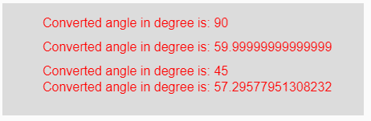

# p5.js |度()功能

> 原文:[https://www.geeksforgeeks.org/p5-js-degrees-function/](https://www.geeksforgeeks.org/p5-js-degrees-function/)

p5.js 中的**度()函数**用于将给定的弧度测量值转换为其对应的度值。

**语法:**

```
degrees( radian )
```

**参数:**该功能接受单个参数**弧度**，需要转换成度数。

**返回值:**返回转换后的角度，单位为度。

下面的程序说明了 p5.js 中的 degrees()函数:

**示例 1:** 本示例使用 degrees()函数将给定的弧度测量值转换为其对应的度数值。

```
function setup() { 

    // Creating Canvas size
    createCanvas(450, 140); 
} 

function draw() { 

    // Set the background color 
    background(220); 

    // Initializing some angles in radians
    let Rad1 = PI; 
    let Rad2 = PI / 2; 
    let Rad3 = PI / 4; 
    let Rad4 = 67; 

    // Calling to degrees() function
    let A = degrees(Rad1);
    let B = degrees(Rad2);
    let C = degrees(Rad3);
    let D = degrees(Rad4);

    // Set the size of text 
    textSize(16); 

    // Set the text color 
    fill(color('red')); 

    // Getting converted angles into degree
    text("Converted angle in degree is: " + A, 50, 30);
    text("Converted angle in degree is: " + B, 50, 60);
    text("Converted angle in degree is: " + C, 50, 90);
    text("Converted angle in degree is: " + D, 50, 110);
} 
```

**输出:**


**示例 2:** 本示例使用 degrees()函数将给定的弧度测量值转换为其对应的度数值。

```
function setup() { 

    // Creating Canvas size
    createCanvas(450, 140); 
} 

function draw() { 

    // Set the background color 
    background(220); 

    // Calling to degrees() function with different
    // radians value as parameter
    let A = degrees(PI/2);
    let B = degrees(PI/3);
    let C = degrees(PI/4);
    let D = degrees(PI/PI);

    // Set the size of text 
    textSize(16); 

    // Set the text color 
    fill(color('red')); 

    // Getting converted angles into degree
    text("Converted angle in degree is: " + A, 50, 30);
    text("Converted angle in degree is: " + B, 50, 60);
    text("Converted angle in degree is: " + C, 50, 90);
    text("Converted angle in degree is: " + D, 50, 110);
}  
```

**输出:**


**参考:**T2】https://p5js.org/reference/#/p5/degrees