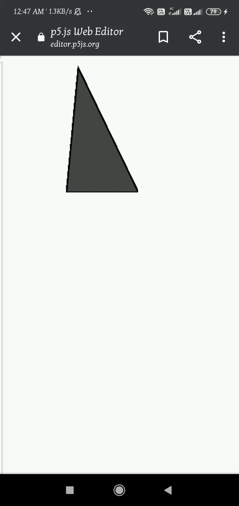
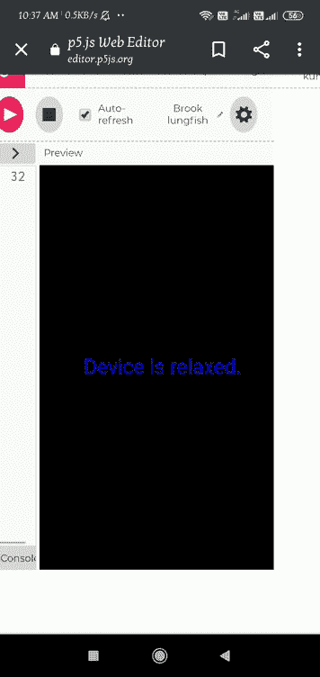

# p5.js deviceMoved()功能

> 原文:[https://www.geeksforgeeks.org/p5-js-devicemoved-function/](https://www.geeksforgeeks.org/p5-js-devicemoved-function/)

功能 **deviceMoved()** 在设备中工作，当设备沿 X、Y 或 Z 三个轴移动超过阈值时调用。

它只在像移动电话这样的设备中工作，它有助于检测设备何时移动或旋转超过阈值。

它可以用作移动设备中的传感器，例如检测运动、加速度、旋转、航向和位置..

默认阈值设置为 **0.5** ，可以使用**设置移动阈值()**功能进行更改。

**语法:**

```
deviceMoved()
```

现在我们将在安卓手机上运行一些例子。

**第一步:**使用任意浏览器“https://editor.p5js.org/”在手机中打开 p5.js 的在线网页编辑器

**第二步:**在编辑器部分写下下面的代码，运行它查看输出。

**例 1:**

## java 描述语言

```
// Set value to zero
let value = 0;

// Set the draw function
function draw() {

    // When the device is moved
    // in the all direction then
    // the colour fill filled
    fill(value);

    // Set the shape of thr Graphics
    triangle(45, 100, 54, 5, 100, 100);
}

// Apply the deviceMoved function
function deviceMoved() {

    // Increment the value everytime by 10
    value = value + 10;

    // If the value become greater than 255
    // then reset the value to zero.
    if (value > 255) {
        value = 0;
    }
}
```

**输出:**



**例 2:**

## java 描述语言

```
// Set the variable as 0
var value = 0;

// Set the function
function setup() {
    createCanvas(windowWidth, windowHeight);

    // Set the background as value which
    // will be dynamic
    background(value);
}

// Set the draw function
function draw() {

    // Set the properties of text
    background(value);
    fill(0, 0, 255);
    textAlign(CENTER, CENTER);
    textSize(25);

    // Set the limit for value
    value = constrain(value - 2, 0, 200)

    // If the value is greater than 10
    if (value > 10) {
        text("Moving Device", width / 2, height / 2);
    } else {
        text("Device is Relaxed ", width / 2, height / 2);
    }
}

function deviceMoved() {

    // Now increase the value.
    value = constrain(value + 5, 0, 255)
}
```

**输出:**

