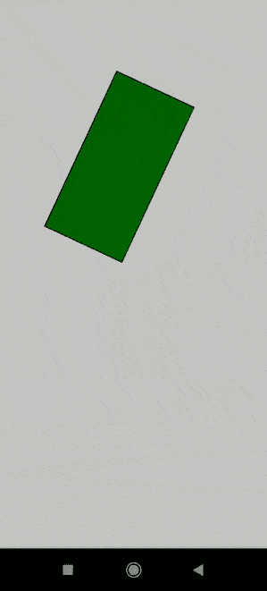

# p5.js deviceOrientation 变量

> 原文:[https://www . geesforgeks . org/P5-js-device orientation-variable/](https://www.geeksforgeeks.org/p5-js-deviceorientation-variable/)

**设备方向**变量包含设备的方向。代码中该变量的值将设置为**风景**或**肖像**。它在移动设备中用于检测方向，如果需要，可用于将草图更改为另一个方向。当没有数据可用时，变量将被设置为**未定义。**

**语法:**

```
deviceOrientation
```

**示例:**

## java 描述语言

```
// Define variables that would hold the
// x, y and z values of orientation
let x = 0;
let y = 0;
let z = 0;

function setup() {

  createCanvas(400, 400);
  if (window.DeviceOrientationEvent) {

    // Add event listener to the function when
    // the device orientation changes
    window.addEventListener("deviceorientation", 
      onOrientationChange);
  }
}

function draw() {
  background(255, 255, 255);
  angleMode(DEGREES);

  rectMode(CENTER);
  translate(width / 2, height / 2);

  // Rotate on the basis of the y-axis
  rotate(y);

  let c = color("green");
  fill(c);

  // Draw a rectangle and fill the above
  rect(0, 0, 100, 200);
}

// Assign the x, y, z variables to
// the event details
function onOrientationChange(e) {
  x = e.x;
  y = e.y;
  z = e.z;

  console.log("X:", x, "Y:", y, "Z:", z);
}
```

**输出:**

