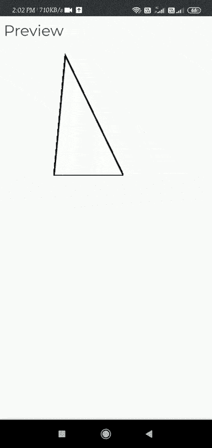

# p5.js deviceTurned()功能

> 原文:[https://www.geeksforgeeks.org/p5-js-deviceturned-function/](https://www.geeksforgeeks.org/p5-js-deviceturned-function/)

当设备连续旋转 90 度以上时，调用函数 deviceTurned。触发设备旋转()方法的轴存储在**旋转轴**变量中。

通过将旋转轴变量与“X”、“Y”或“Z”进行比较，可以锁定该功能以在所有三个轴上触发。

这是**移动应用程序开发**功能，允许访问特定的传感器和操作模式，如检测设备中的运动、加速度、旋转、航向和位置。

**语法:**

```
deviceTurned()
```

现在我们将在安卓手机上运行一些例子。

*   **第一步:**使用任意浏览器打开手机中 p5.js 的在线网页编辑器“**https://editor.p5js.org/**
*   **第二步:**在编辑器部分写下下面的代码，运行它查看输出。

**例 1:**

## java 描述语言

```
// Run this example on a mobile device
// Rotate the device by 90 degrees in the
// X-axis or Y-axis or Z- axis to change the value .

let value = 0;
function draw() {
  fill(value);
  triangle(45, 100, 54, 5, 100, 100);
}

//  Set the the device turned function.
function deviceTurned() {
  if (turnAxis === 'X' ||turnAxis === 'Y'|| turnAxis === 'Z') {
    if (value === 0) {
      value = 255;
    } else if (value === 255) {
      value = 0;
    }
  }
}
```

**输出:**我们将通过在 X、Y 或 Z 方向旋转 90 度来旋转我们的设备来获得这个。



**参考:**T2】https://p5js.org/reference/#/p5/deviceTurned