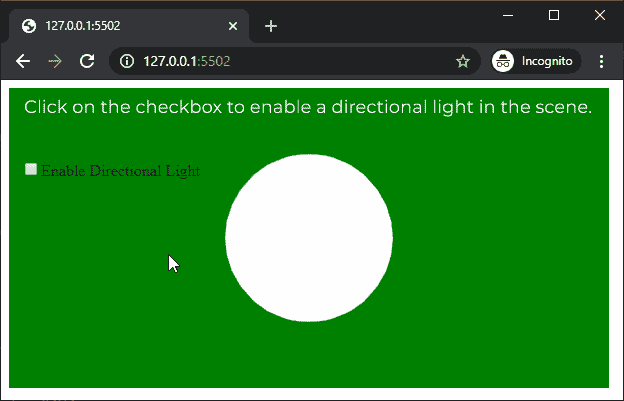
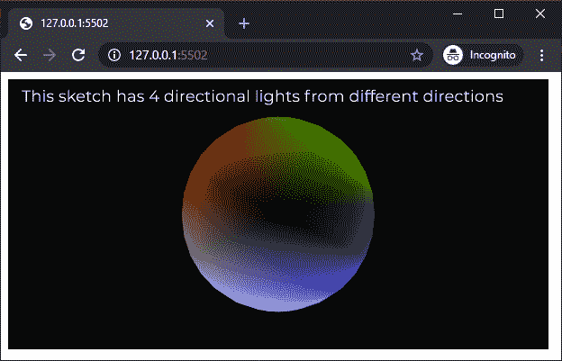

# P5 . js | directionalight()功能

> 原文:[https://www . geesforgeks . org/P5-js-directionallight-function/](https://www.geeksforgeeks.org/p5-js-directionallight-function/)

p5.js 中的**方向灯()功能**用于创建具有指定颜色和方向的方向灯。定向光线沿其路径无限穿过场景，因此光线的距离无关紧要。一个场景中最多可以有 5 个方向灯处于活动状态。

**语法:**

```
directionalLight( v1, v2, v3, position )
```

运筹学

```
directionalLight( color, x, y, z )
```

运筹学

```
directionalLight( color, position )
```

运筹学

```
directionalLight( v1, v2, v3, x, y, z )
```

**参数:**该功能接受 8 个参数，如上所述，描述如下:

*   **v1:** 是决定相对于当前颜色范围的红色或色相值的数字。
*   **v2:** 是决定相对于当前颜色范围的绿色或饱和度值的数字。
*   **v3:** 是决定相对于当前颜色范围的蓝色或亮度值的数字。
*   **位置:**是 p5。表示方向光方向的向量。
*   **颜色:**是 p5。定义方向光颜色的颜色或颜色字符串。
*   **x:** 是定义光线 x 轴方向的数字。
*   **y:** 是定义光线 y 轴方向的数字。
*   **z:** 是定义光线 z 轴方向的数字。

下面的例子说明了 p5.js 中的 **directionalLight()函数**:

**例 1:**

```
let newFont;
let directionalLightEnable = false;

function preload() {
  newFont = loadFont('fonts/Montserrat.otf');
}

function setup() {
  createCanvas(600, 300, WEBGL);
  textFont(newFont, 18);

  directionalLightCheck = createCheckbox(
        "Enable Directional Lights", false);

  directionalLightCheck.position(20, 80);

  // Toggle point light
  directionalLightCheck.changed(() => {
    directionalLightEnable = !directionalLightEnable;
  });
}

function draw() {
  background('green');
  text("Click on the checkbox to enable directional"
        + " lights in the scene.", -285, -125);

  if (directionalLightEnable) {
    directionalLight(255, 0, 0, height / 2, width / 2, -250);
  }
  noStroke();
  sphere(80);
}
```

**输出:**


**例 2:**

```
let newFont;
let directionalLightEnable = false;

function preload() {
  newFont = loadFont('fonts/Montserrat.otf');
}

function setup() {
  createCanvas(600, 300, WEBGL);
  textFont(newFont, 18);
}

function draw() {
  background('black');
  text("This sketch has 4 directional lights "
    + "from different directions", -285, -125);

  directionalLight(255, 0, 0, height / 2, width / 2, -1);
  directionalLight(0, 0, 255, -height / 2, -width / 2, -1);
  directionalLight(0, 255, 0, -height / 2, width / 2, -1);
  directionalLight(255, 255, 255, height / 2, -width / 2, -1);

  noStroke();
  sphere(100);
}
```

**输出:**


**在线编辑:**[https://editor.p5js.org/](https://editor.p5js.org/)

**环境设置:**

**参考:**T2】https://p5js.org/reference/#/p5/directionalLight