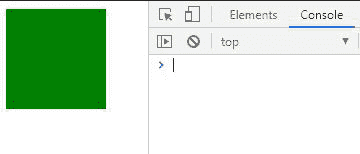

# P5 . js disablefriendyerrors 属性

> 原文:[https://www . geesforgeks . org/P5-js-disablefriendyerrors-property/](https://www.geeksforgeeks.org/p5-js-disablefriendlyerrors-property/)

友好错误系统(FES)用于在使用非精简的 p5.js 文件(而不是 p5.min.js)时警告用户。这些友好的错误本质上并不重要，但是在控制台中出现它们是令人不安的。这些可以在**disablefriendyerrors**属性的帮助下关闭。这也可以提高草图的性能。

**注意:**一些友好的错误很重要，比如没有在函数中插入合适的参数。这些可能会导致程序出现问题，禁用错误会使确定实际原因变得非常困难。此属性的默认值为 false。

**语法:**

```
p5.disableFriendlyErrors = true;
```

下面的例子说明了 p5.js 中的**disablefriendyerrors 属性**:

**例 1:**

## java 描述语言

```
// This will disable friendly error messages
p5.disableFriendlyErrors = true;

// Notice that the spelling of preload is wrong
// This should throw a friendly error
// but it will not as they are disabled.
function preLoad() {
  console.log("hi");
}

function setup() {
  createCanvas(100, 100);
}

function draw() {
  background('green');
}
```

**输出:**控制台中没有显示错误信息



**例 2:**

## java 描述语言

```
// This will disable friendly error messages
p5.disableFriendlyErrors = true;

function setup() {
  createCanvas(100, 100);
}

function draw() {
  background('red');

  // This should throw a friendly error,
  // however it will not as they are disabled
  arc(1, 1, 10.5, 10);
}
```

**输出:**控制台中没有显示错误信息

