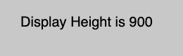
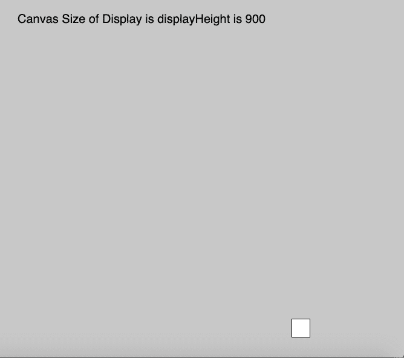

# p5.js |显示高度变量

> 哎哎哎::1230【https://www . geeksforgeeks . org/P5-js-display height 变量/

p5.js 中的 **displayHeight** 变量用于*存储设备*屏幕显示的高度。高度值根据**默认像素度**存储。该变量用于在任何显示尺寸上运行全屏程序。将其乘以 pixelDensity 以返回实际屏幕大小。

**语法:**

```
displayHeight

```

**参数:**此功能不接受任何参数。

下面程序举例说明了**显示高度**变量在 P5 . js:
T3】示例-1:

```
function setup() {

    createCanvas(1000, 400);

    // Set text size to 40px
    textSize(20); 
}

function draw() {
    background(200);
    rect(mouseX, mouseY, 30, 30);

    //Use of displayHeight Variable
    text("Display Height is " + displayHeight, 30, 40);
}
```

**输出:**


**示例-2:**

```
function setup() {

    createCanvas(1000, displayHeight);

    // Set text size to 40px
    textSize(20);
}

function draw() {

    background(200);
    rect(mouseX, mouseY, 30, 30);

    //Use of displayHeight Variable
    text("Canvas Size of Display is displayHeight is " 
         + displayHeight, 30, 40);
}
```

**输出:**


**参考:**T2】https://p5js.org/reference/#/p5/displayHeight