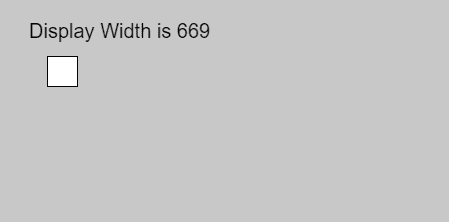
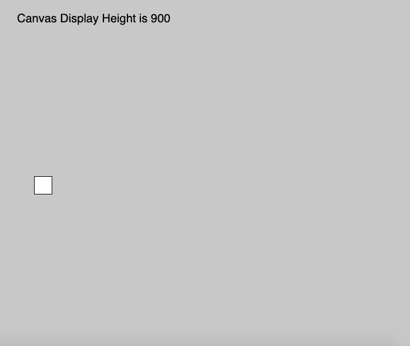

# p5.js |显示宽度变量

> 原文:[https://www.geeksforgeeks.org/p5-js-displaywidth-variable/](https://www.geeksforgeeks.org/p5-js-displaywidth-variable/)

p5.js 中的 **displayWidth** 变量用于*存储设备*的屏幕显示宽度，它是根据默认的像素宽度。该变量用于在任何显示尺寸上运行全屏程序。将其乘以像素度，返回实际屏幕尺寸。

**语法:**

```
displayWidth()

```

**参数:**此功能不接受任何参数。

下面的程序说明了 p5.js 中的 displayWidth 变量:
**示例-1:**

```
function setup() {

    // use of displayWidth variable
    createCanvas(displayWidth, 400);

    // Set text size to 40px
    textSize(20);
}

function draw() {

    background(200);
    rect(mouseX, mouseY, 30, 30);

    //Use of windowWidth Variable
    text("Display Width is " + windowWidth, 30, 40);
}
```

**输出:**


**示例-2:**

```
function setup() {

    // use of displayWidth variable
    createCanvas(displayWidth, displayHeight);

    // Set text size to 40px
    textSize(20);
}

function draw() {
    background(200);
    rect(mouseX, mouseY, 30, 30);

    //Use of windowWidth Variable
    text("Canvas Display Height is " + displayHeight, 30, 40);
}
```

**输出:**


**参考:**T2】https://p5js.org/reference/#/p5/displayWidth