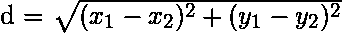
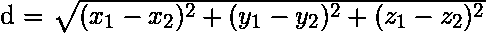
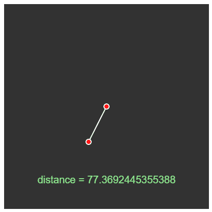
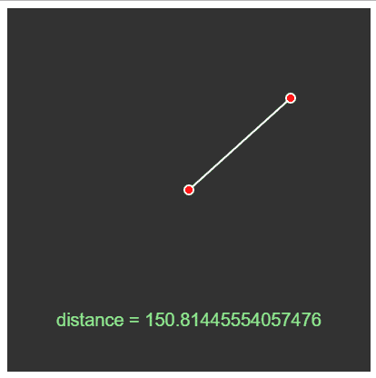

# p5.js | dist()函数

> 原文:[https://www.geeksforgeeks.org/p5-js-dist-function/](https://www.geeksforgeeks.org/p5-js-dist-function/)

**dist()函数**计算 2D 或 3D 中的欧几里德距离。表示 **p5.js | dist()函数**用于测量 2D 或 3D 中两点之间的距离。下面是 2D 和 3D 中的距离公式。

*   **2D 公式:**
    
*   **3D 公式:**
    

**语法:**

```
dist(x1, y1, x2, y2)

```

```
dist(x1, y1, z1, x2, y2, z2)

```

**参数:**

*   **x1:** 这些参数保存第一个点的 x 坐标。
*   **y1:** 这些参数保持第一点的 y 坐标。
*   **z1:** 这些参数保持第一点的 z 坐标。
*   **x2:** 这些参数保持第二个点的 x 坐标。
*   **y2:** 这些参数保持第二点的 y 坐标。
*   **z2:** 这些参数保持第二个点的 z 坐标。

**返回值:**两点之间的距离。
**示例:**本示例计算并打印固定点与光标之间的距离。

```
function setup() {
    // Create a canvas
    createCanvas(400, 400);
}

function draw() {
    // set background color
    background(50);
    // coordinates of the fixed point
    var x1 = 200;
    var y1 = 200;
    // coordinates of the cursor
    var x2 = mouseX;
    var y2 = mouseY;
    // set line color and weight
    stroke(255);
    strokeWeight(2);
    // draw a line connecting 2 points
    line(x1, y1, x2, y2);
    fill("red");
    // draw a circle centered at each point
    ellipse(x1, y1, 10);
    ellipse(x2, y2, 10);
    // calculate the distance between 2 points
    d = dist(x1, y1, x2, y2);
    noStroke();
    fill("lightgreen");
    // set text size and alignment
    textSize(20);
    textAlign(CENTER);
    // display the distance calculated
    text("distance = "+ str(d), 200, 350);
}
```

**输出:**




**在线编辑:**[【https://editor.p5js.org/】](https://editor.p5js.org/)
**环境设置:**[https://www . geeksforgeeks . org/P5-js-soundfile-object-installation-and-methods/](https://www.geeksforgeeks.org/p5-js-soundfile-object-installation-and-methods/)

**参考:**T2】https://p5js.org/reference/#/p5/dist