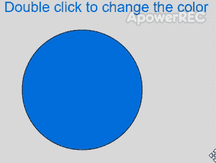
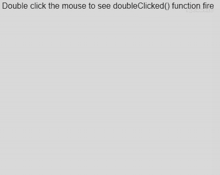

# p5.js |双击()功能

> 原文:[https://www.geeksforgeeks.org/p5-js-doubleclicked-function/](https://www.geeksforgeeks.org/p5-js-doubleclicked-function/)

每当鼠标或定点设备引起**点击**事件时，就会调用**双击()**功能。当指向设备在单个元素上连续快速单击两次时，就会发生这种情况。MouseEvent 回调参数可用于访问单击的详细信息。

**语法:**

```
doubleClicked([event])
```

**参数:**该函数接受如上所述的单个参数，如下所述:

*   **事件:**这是一个可选的 MouseEvent 回调参数。它可用于访问点击详情。

下面的程序说明了 p5.js 中的**双击()功能**:

**示例 1:** 使用双击改变填充颜色。

```
let colorVal = 0;

function setup() {
  createCanvas(500, 300);
  textSize(24);
}

function draw() {
  clear();

  // apply fill based on the red component
  fill(colorVal, 128, 255 - colorVal)

  text("Double click to change the color", 20, 20);
  circle(150, 150, 200);
}

function doubleClicked() {
  // change the value if
  // the event occurs
  if (colorVal < 255)
    colorVal += 50;
  else
    colorVal = 0;
}
```

**输出:**

**示例 2:** 访问 MouseEvent 对象的详细信息。

```
let y = 60;

function setup() {
  createCanvas(500, 200);
  textSize(16);
  text("Double click the mouse to see doubleClicked() function fire", 10, 20);
}

function doubleClicked(event) {
  // get the x and y location
  // of the double click
  locationX = event.x;
  locationY = event.y;

  locString = "Mouse was double clicked at location: "
    + locationX + ", " + locationY;
  text(locString, 10, y);
  y = y + 20;

  console.log(event);
}
```

**输出:**


**在线编辑:**[【https://editor.p5js.org/】](https://editor.p5js.org/)
**环境设置:**[https://www . geeksforgeeks . org/P5-js-soundfile-object-installation-and-methods/](https://www.geeksforgeeks.org/p5-js-soundfile-object-installation-and-methods/)

**参考:**T2】https://p5js.org/reference/#/p5/doubleClicked