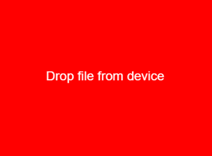
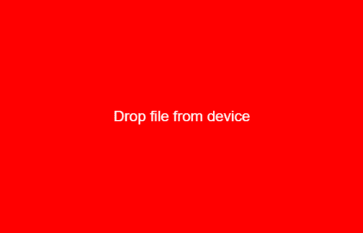

# p5.js | drop()功能

> 原文:[https://www.geeksforgeeks.org/p5-js-drop-function/](https://www.geeksforgeeks.org/p5-js-drop-function/)

**drop()函数**是一个内置函数，用于注册一个回调函数，每当加载文件后文件被放在元素上时，该函数就会被调用。每个被删除的文件都被加载到内存中，并作为 p5 传递。回调函数的文件对象。当多个文件同时删除时，它将显示对回调函数的多次调用。

这个函数需要 p5.dom 库。所以在**index.html**文件的头部增加下面一行。

```
<script language="javascript" 
    type="text/javascript" src="path/to/p5.dom.js">
</script>
```

**语法:**

```
drop( callback, fxn )
```

**参数:**该函数接受两个参数，如上所述，如下所述:

*   **回调:**该参数用于保存加载的文件，每次文件删除时都会调用该文件。
*   **fxn:** 当文件随 drop 事件一起被丢弃时触发回调函数时，使用此参数。

下面的例子说明了 p5.js 中的 drop()函数:

**例 1:**

```
function setup() {  

    // Create Canvas of given size 
     var cvs = createCanvas(400, 300);

    // Set the background color
    background('red');

    // Set the text position
    textAlign(CENTER);

    // Set the font size
    textSize(24);

    // Set the text color
    fill('white');

    // Display the text on the screen
    text('Drop file from device', width / 2, height / 2);

    // Function to drop the file
    cvs.drop(gotFile);
}

function gotFile(file) {

  // Set the background color
  background('green');

  // Display the text on the screen
  text('Received file name with extension:', width / 2, height / 2);

  // Drop file with given position
  text(file.name, width / 2, height / 2 + 50);
}
```

**输出:**

*   **放下文件前:**
    
*   **放下文件后:**
    

**例 2:**

```
var img;

function setup() {  

    // Create Canvas of given size 
     var cvs = createCanvas(600, 400);

    // Set the background color
    background('red');

    // Set the text position
    textAlign(CENTER);

    // Set the font size
    textSize(24);

    // Set the text color
    fill('white');

    // Display the text on the screen
    text('Drop file from device', width / 2, height / 2);

    // Function to drop the file
    cvs.drop(gotFile);
}

function draw() {
  if (img) {
    image(img, 0, 0, width, height);
  }
}

function gotFile(file) {
  img = createImg(file.data).hide();
}
```

**输出:**

*   **放下文件前:**
    
*   **放下文件后:**
    