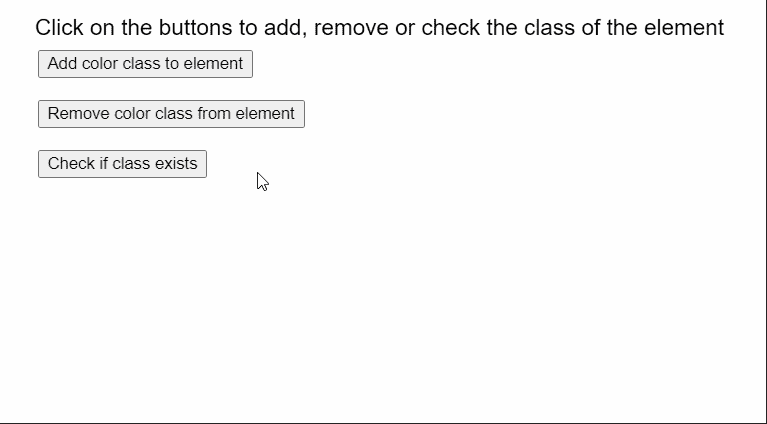

# p5.js 元素 hasClass()方法

> 原文:[https://www . geesforgeks . org/P5-js-element-has class-method/](https://www.geeksforgeeks.org/p5-js-element-hasclass-method/)

p5 的 **hasClass()** 方法。p5.js 中的元素用于检查元素中是否已经存在指定的类。它返回一个布尔值，表示该类是否存在。一个元素可以分配多个类。

**语法:**

```
hasClass( class )

```

**参数:**该函数接受一个参数，如上所述，如下所述。

*   **类:**表示要检查的类的字符串。

**示例:**下面的示例说明了 p5.js 中的 **hasClass()** 方法

```
<html>

<head>
    <script src=
"https://cdn.jsdelivr.net/npm/p5@0.10.2/lib/p5.js">
    </script>
    <script src="sketch.js"></script>
</head>

<body></body>

</html>
```

**Javascript 代码:**上面的“sketch.js”文件使用了下面的代码。

## java 描述语言

```
function setup() {
  createCanvas(600, 300);
  textSize(18);

  // Create a new p5.Element
  tmpElement = createElement("div");

  text("Click on the buttons to add, remove " +
       "or check the class of the element", 20, 20);

  setBtn = 
    createButton("Add color class to element");
    setBtn.position(30, 40);
    setBtn.mouseClicked(() => {
    tmpElement.addClass("color");
  });

  removeBtn =
    createButton("Remove color class from element");
  removeBtn.position(30, 80);
  removeBtn.mouseClicked(() => {
    tmpElement.removeClass("color");
  });

  showBtn = createButton("Check if class exists");
  showBtn.position(30, 120);
  showBtn.mouseClicked(checkClass);
}

function checkClass() {
  clear();
  // Check if the given class exists
  let hasC = tmpElement.hasClass("color");

  text("hasClass('color') gives the output: " +
       hasC, 20, 180);

  text("Click on the buttons to add, remove or " +
       "check the class of the element", 20, 20);
}
```

**输出:**



**在线编辑:**[【https://editor.p5js.org/】](https://editor.p5js.org/)
**环境设置:**[https://www . geeksforgeeks . org/P5-js-soundfile-object-installation-and-methods/](https://www.geeksforgeeks.org/p5-js-soundfile-object-installation-and-methods/)
**参考:**[https://p5js.org/reference/#/p5.Element/hasClass](https://p5js.org/reference/#/p5.Element/hasClass)