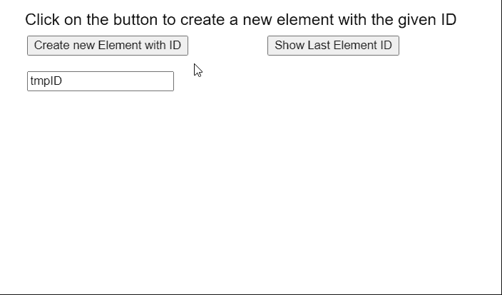
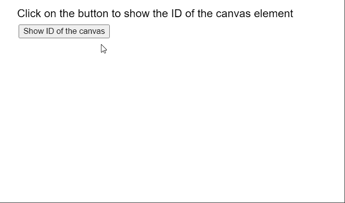

# p5.js 元素 id()方法

> 原文:[https://www.geeksforgeeks.org/p5-js-element-id-method/](https://www.geeksforgeeks.org/p5-js-element-id-method/)

p5 的 **id()** 方法。p5.js 中的元素用于设置或返回元素的 ID。当没有将标识指定为参数时，它返回元素的当前标识。页面上只有一个元素可以指定特定的标识。

**语法:**

```
id( id )

```

**参数:**该函数接受一个参数，如上所述，如下所述。

*   **id:** 是表示元素 id 的字符串。

**示例 1:** 下面的示例说明了 p5.js 中的 **id()** 方法。

## java 描述语言

```
function setup() {
  createCanvas(550, 300);
  textSize(18);

  text("Click on the button to create a new " +
       "element with the given ID", 20, 20);

  setBtn = 
    createButton("Create new Element with ID");
  setBtn.position(30, 40);
  setBtn.mouseClicked(createNewElement);

  setBtn = 
    createButton("Show Last Element ID");
  setBtn.position(300, 40);
  setBtn.mouseClicked(showID);

  id_name = createInput('tmpID');
  id_name.position(30, 80);
}

function createNewElement() {
  clear();

  // Create a new p5.Element
  tmpElement = createElement("p");

  // Get the ID to set
  let idToSet = id_name.value();

  // Set the ID of the element
  tmpElement.id(idToSet);

  text("New element created with ID: " +
       idToSet, 30, 120);

  text("Click on the button to create a new " +
       "element with the given ID", 20, 20);
}

function showID() {
  clear();

  // Get the ID of the element
  let setID = tmpElement.id();

  // Display the ID
  text("The ID of the last element is: " + 
       setID, 30, 120);

  text("Click on the button to create a new " +
       "element with the given ID", 20, 20);
}
```

**输出:**



**例 2:**

## java 描述语言

```
function setup() {

  // Create a new canvas
  canv = createCanvas(550, 300);

  // Set the ID of the canvas
  canv.id("newCanvas");

  textSize(18);
  text("Click on the button to show the ID " +
       "of the canvas element", 20, 20);

  setBtn = 
    createButton("Show ID of the canvas");
  setBtn.position(30, 40);
  setBtn.mouseClicked(showID);
}

function showID() {
  clear();

  // Get the ID of the element
  let setID = canv.id();

  // Display the ID
  text("The ID of the canvas is: " +
       setID, 20, 80);

  text("Click on the button to show the ID " +
       "of the canvas element", 20, 20);
}
```

**输出:**



**在线编辑:**[【https://editor.p5js.org/】](https://editor.p5js.org/)
**环境设置:**[https://www . geeksforgeeks . org/P5-js-soundfile-object-installation-and-methods/](https://www.geeksforgeeks.org/p5-js-soundfile-object-installation-and-methods/)
**参考:**[https://p5js.org/reference/#/p5.Element/id](https://p5js.org/reference/#/p5.Element/id)