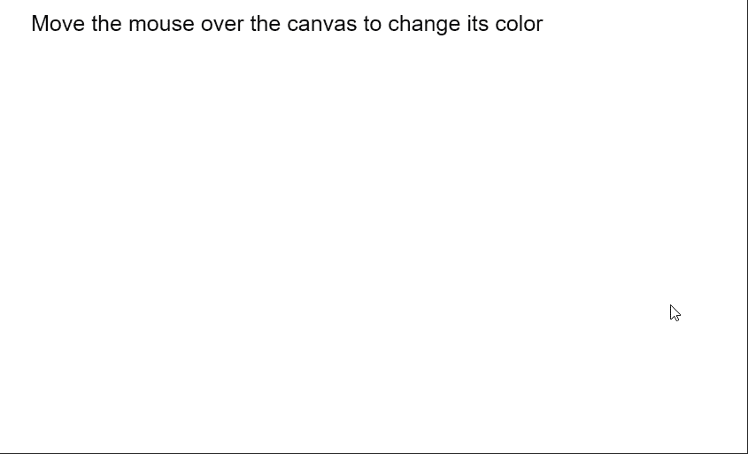

# p5.js 元素 mouseOut()方法

> 原文:[https://www . geesforgeks . org/P5-js-element-mouse out-method/](https://www.geeksforgeeks.org/p5-js-element-mouseout-method/)

**鼠标移出()** **五常之法**。每当用户将鼠标指针移出元素时，都会调用 p5.js 中的元素。它可用于将事件侦听器附加到元素。

**语法:**

```
mouseOut( fxn )

```

**参数:**该函数接受如上所述的单个参数，如下所述:

*   **fxn:** 这是一个每当鼠标离开元素时都会触发的函数。*值为假*也可以传递给它，以防止之前的功能触发。

下面的例子说明了 p5.js 中的 **mouseOut()方法**:

**示例:**

## java 描述语言

```
function setup() {
    canv = createCanvas(550, 300);
    textSize(20);

    text("Move the mouse over the canvas " +
        "to change its color", 20, 20);

    canv.mouseOver(changeColor);

    // Specify the callback function
    // when the mouse is moved out of
    // an element
    canv.mouseOut(origColor);
}

function changeColor() {
    background("green");

    text("The mouse has been moved over " +
        "the canvas!", 20, 60);

    text("Move the mouse over the canvas " +
        "to change its color", 20, 20);
}

function origColor() {
    background("white");

    text("The mouse has been moved off " +
        "the canvas!", 20, 60);

    text("Move the mouse over the canvas to " +
        "change its color", 20, 20);
}
```

**输出:**



**在线编辑:**[【https://editor.p5js.org/】](https://editor.p5js.org/)
**环境设置:**[https://www . geeksforgeeks . org/P5-js-soundfile-object-installation-and-methods/](https://www.geeksforgeeks.org/p5-js-soundfile-object-installation-and-methods/)
**参考:**[https://p5js.org/reference/#/p5.Element/mouseOut](https://p5js.org/reference/#/p5.Element/mouseOut)