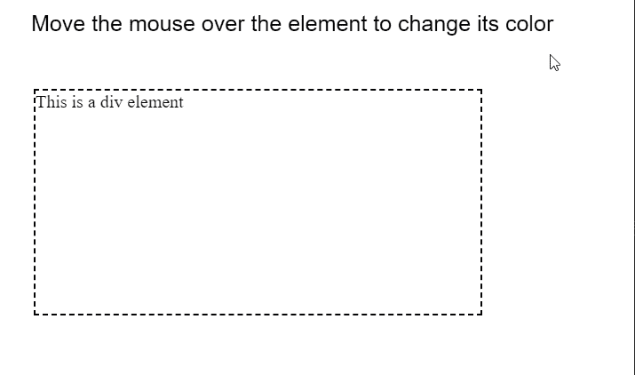

# p5.js 元素鼠标悬停()方法

> 原文:[https://www . geesforgeks . org/P5-js-element-mouseover-method/](https://www.geeksforgeeks.org/p5-js-element-mouseover-method/)

**鼠标悬停()** **五常之法**。每当用户在元素上移动鼠标指针时，都会调用 p5.js 中的元素。它可用于将事件侦听器附加到元素。

**语法:**

```
mouseOver( fxn )

```

**参数:**该函数接受如上所述的单个参数，如下所述:

*   **fxn:** 这是一个每当鼠标移动到元素上时都会触发的函数。*值为假*也可以传递给它，以防止之前的功能触发。

下面的例子说明了 p5.js 中的 **mouseOver()方法**:

**示例:**

## java 描述语言

```
function setup() {
    canv = createCanvas(550, 300);
    textSize(20);

    text("Move the mouse over the element "
        + "to change its color", 20, 20);

    divelem =
        createDiv("This is a div element");
    divelem.position(30, 80);
    divelem.size(400, 200);
    divelem.style("border: 2px dashed");

    // Using the mouseOver() method
    // for a callback to changeColor()
    divelem.mouseOver(changeColor);
}

function changeColor() {
    divelem.style(
        "background-color: lightgreen"
    );

    divelem.html(
        "The mouse has been moved over the element!"
    );
}
```

**输出:**



**在线编辑:**[【https://editor.p5js.org/】](https://editor.p5js.org/)
**环境设置:**[https://www . geeksforgeeks . org/P5-js-soundfile-object-installation-and-methods/](https://www.geeksforgeeks.org/p5-js-soundfile-object-installation-and-methods/)
**参考:**[https://p5js.org/reference/#/p5.Element/mouseOver](https://p5js.org/reference/#/p5.Element/mouseOver)