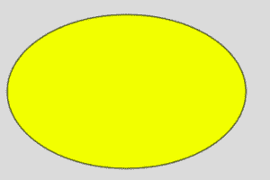

# p5.js |椭圆()函数

> 原文:[https://www.geeksforgeeks.org/p5-js-ellipse-function/](https://www.geeksforgeeks.org/p5-js-ellipse-function/)

椭圆()函数是 p5.js 中的一个内置函数，用于绘制椭圆。

**语法:**

```
ellipse(x, y, w, h)
ellipse(x, y, w, h, detail)

```

**参数:**该功能接受五个参数，如上所述，描述如下:

*   **x:** 此参数取椭圆的 x 坐标。
*   **y:** 此参数取椭圆的 y 坐标。
*   **w:** 此参数取椭圆的宽度。
*   **h:** 此参数取椭圆的高度。
*   **细节:**是可选参数，取需要绘制的径向扇区数为整数。

下面的程序说明了 P5.js 中的椭圆()函数:

```
function setup() {
    createCanvas(400, 400);
}

function draw() {
    background(220);
    fill('yellow');

    // An ellipse at 150, 150 with radius 280
    ellipse(150, 150, 280, 180) 
} 
```

**输出:**


**参考:**T2】https://p5js.org/reference/#/p5/ellipse