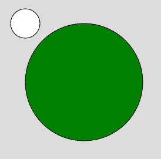
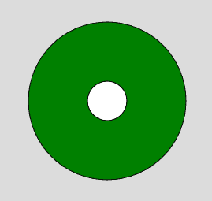

# P5 . js | ellipsmode()功能

> 原文:[https://www.geeksforgeeks.org/p5-js-ellipsemode-function/](https://www.geeksforgeeks.org/p5-js-ellipsemode-function/)

**椭圆模式()函数**是 p5.js 中的一个内置函数，用于通过改变方式来设置椭圆的绘制位置。该功能的默认模式是椭圆模式(中心)。

**语法:**

```
ellipseMode( mode )
```

**参数:**该功能接受如上所述的单个参数，描述如下:

*   **模式:**该参数包含不同的模式常量，这些常量区分大小写，因此必须用大写字母表示。模式有中心、半径、拐角或拐角。

**例 1:**

```
function setup() { 

    // Create Canvas of given size 
    createCanvas(300, 300); 

} 

function draw() { 

    background(220);

    // Set ellipseMode to RADIUS
    ellipseMode(CORNER);

    // Fill color
    fill('green');

    // Draw the ellipse
    ellipse(150, 150, 100, 100);

    // Set ellipseMode to CENTER
    ellipseMode(CONRNERS); 

    // Fill color
    fill("white");

    // Draw the ellipse
    ellipse(50, 50, 50, 50);

} 
```

**输出:**


**例 2:**

```
function setup() { 

    // Create Canvas of given size 
    createCanvas(300, 300); 

} 

function draw() { 

    background(220);

    // Set ellipseMode to RADIUS
    ellipseMode(RADIUS);

    // Fill color
    fill('green');

    // Draw the ellipse
    ellipse(150, 150, 100, 100);

    // Set ellipseMode to CENTER
    ellipseMode(CENTER); 

    // Fill color
    fill("white");

    // Draw the ellipse
    ellipse(150, 150, 50, 50);

} 
```

**输出:**


**在线编辑:**[【https://editor.p5js.org/】](https://editor.p5js.org/)
**环境设置:**[https://www . geeksforgeeks . org/P5-js-soundfile-object-installation-and-methods/](https://www.geeksforgeeks.org/p5-js-soundfile-object-installation-and-methods/)

**参考:**T2】https://p5js.org/reference/#/p5/ellipseMode