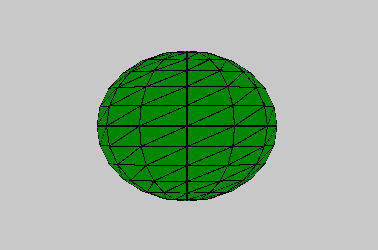
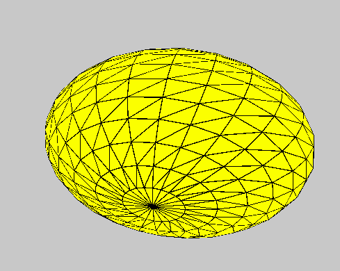

# p5.js |椭球()函数

> 原文:[https://www.geeksforgeeks.org/p5-js-ellipsoid-function/](https://www.geeksforgeeks.org/p5-js-ellipsoid-function/)

p5.js 中的**椭球()函数**用于绘制给定半径的椭球。

**语法:**

```
ellipsoid( radiusX, radiusY, radiusZ, detailX, detailY )
```

**参数:**该功能接受五个参数，如上所述，描述如下:

*   **半径:**该参数存储椭球的 x 半径。*   **半径:**该参数存储椭球的 y 半径。*   **半径:**该参数存储椭球的 z 半径。*   **detailX:** 此参数存储 x 维中的线段数。*   **detailY:** This parameter stores the number of segments in y-dimension.

    下面的程序说明了 p5.js 中的椭球()函数:

    **示例 1:** 本示例使用椭球()函数绘制给定半径的椭球。

    ```
    function setup() {

        // Create Canvas of size 600*600
        createCanvas(600, 600, WEBGL);
    }

    function draw() {

        // Set background color
        background(200);

        // Set fill color of ellipsoid
        fill('green');

        // Call to ellipsoid function
        ellipsoid(90, 75, 32, 12, 12);
    }
    ```

    **输出:**
    

    **示例 2:** 本示例使用椭球()函数绘制给定半径的椭球。

    ```
    function setup() {

        // Create Canvas of size 600*600
        createCanvas(600, 600, WEBGL);
    }

    function draw() {

        // Set background color
        background(200);

        // Set fill color of ellipsoid
        fill('yellow');

        // Rotate 
        rotateX(frameCount * 0.01);
        rotate(frameCount*0.03);

        // Call to ellipsoid function
        ellipsoid(190, 135, 130);
    }
    ```

    **输出:**
    
    **参考:**[https://p5js.org/reference/#/p5/ellipsoid](https://p5js.org/reference/#/p5/ellipsoid)