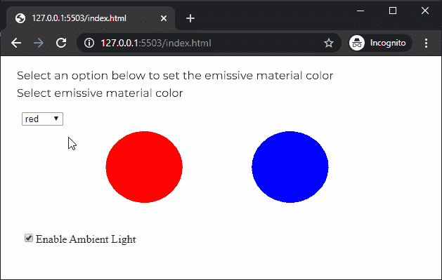

# P5 . js | emissivimaterial()函数

> 原文:[https://www . geesforgeks . org/P5-js-emissiviemamaterial-function/](https://www.geeksforgeeks.org/p5-js-emissivematerial-function/)

p5.js 中的**发射材料()函数**用于为给定颜色的几何图形创建发射材料。物体的发射率使它看起来像是在发光。与环境材料或镜面材料不同，即使场景中没有光，发光材料仍会以最大强度显示。

**语法:**

```
emissiveMaterial( v1, [v2], [v3], [a] )
```

运筹学

```
emissiveMaterial( color )
```

**参数:**该函数接受四个参数，如上所述，如下所述:

*   **v1:** 是决定灰度值，或者相对于当前颜色范围的红色或色相值的数字。
*   **v2:** 是决定相对于当前颜色范围的绿色或饱和度值的数字。这是一个可选参数。
*   **v3:** 是决定相对于当前颜色范围的蓝色或亮度值的数字。这是一个可选参数。
*   **a:** 是表示材料不透明度的数字。这是一个可选参数。
*   **颜色:**是 p5。定义材料颜色的颜色或颜色字符串。

下面的例子说明了 p5.js 中的**emissivimaterial()函数**:

**示例:**下面的示例表明，无论环境光线如何，发光材料总是会发光。

```
let newFont;
let hasAmbientLight = true;
let currentEmissiveColor = "red";

function preload() {
  newFont = loadFont('fonts/Montserrat.otf');
}

function setup() {
  createCanvas(600, 300, WEBGL);
  textFont(newFont, 16);

  // Create checkbox to enable/disable ambient light
  redCheckbox = createCheckbox('Enable Ambient Light', true);
  redCheckbox.position(30, 250);
  redCheckbox.changed(() => hasAmbientLight = !hasAmbientLight);

  // Create a selector for selecting the directional light color
  lightColorSel = createSelect();
  lightColorSel.position(30, 80);
  lightColorSel.option('red');
  lightColorSel.option('green');
  lightColorSel.option('blue');
  lightColorSel.changed(() => {
    currentEmissiveColor = lightColorSel.value();
  });
}

function draw() {
  background('white');
  fill('black');

  text("Select an option below to set the emissive material color",
                                                        -285, -125);
  text("Select emissive material color", -285, -100);
  noStroke();

  // Enable ambient light if the checkbox is enabled
  if (hasAmbientLight)
    ambientLight(0, 0, 255);

  // Draw sphere which uses emissive material
  emissiveMaterial(currentEmissiveColor);
  translate(-100, 0, 0);
  sphere(50);
  translate(100, 0, 0);

  // Draw sphere which uses ambient material
  ambientMaterial(255);
  translate(100, 0, 0);
  sphere(50);
  translate(-100, 0, 0);
}
```

**输出:**


**在线编辑:**[https://editor.p5js.org/](https://editor.p5js.org/)

**环境设置:**

**参考:**T2】https://p5js.org/reference/#/p5/emissiveMaterial