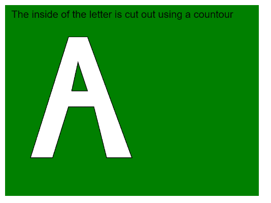

# p5.js | endContour()函数

> 原文:[https://www.geeksforgeeks.org/p5-js-endcontour-function/](https://www.geeksforgeeks.org/p5-js-endcontour-function/)

p5.js 中的 **endContour()函数**用于在使用 **beginContour()** 函数创建计数时停止记录顶点。这些函数用于从另一个形状中移除形状的一部分。

内部形状的顶点必须定义在与外部形状相反的方向上。如果外部形状的顶点是按顺时针顺序定义的，那么内部形状必须按逆时针方向定义。然后使用此功能停止记录内部形状。

该功能只能在 **beginShape()** 或 **endShape()** 功能中使用。像**平移()**、**旋转()**和**缩放()**这样的变换不适用于形状和轮廓。

**语法:**

```
endContour()
```

**参数:**此功能不接受参数。

下面的程序说明了 p5.js 中的 **endContour()** 功能:

**示例:**

```
function setup() {
  createCanvas(400, 300);
  textSize(16);
}

function draw() {
  clear();
  background("green");
  text("The inside of the letter is cut out"+
       " using a countour", 10, 20);

  // Starting the shape
  // using beginShape()
  beginShape();

  // Specifying all the vertices
  // of the exterior shape
  vertex(40, 240);
  vertex(100, 50);
  vertex(130, 50);
  vertex(200, 240);
  vertex(160, 240);
  vertex(140, 160);
  vertex(100, 160);
  vertex(75, 240);

  // Starting a contour
  beginContour();

  // Specifying all the vertices
  // of the interior shape
  // in counter-clockwise order
  vertex(130, 135);
  vertex(115, 90);
  vertex(105, 135);

  // Ending the contour
  // using endContour()
  endContour();

  // Ending the shape
  endShape(CLOSE);
}
```

**输出:**


**在线编辑:**[【https://editor.p5js.org/】](https://editor.p5js.org/)
**环境设置:**[https://www . geeksforgeeks . org/P5-js-soundfile-object-installation-and-methods/](https://www.geeksforgeeks.org/p5-js-soundfile-object-installation-and-methods/)

**参考:**T2】https://p5js.org/reference/#/p5/endContour