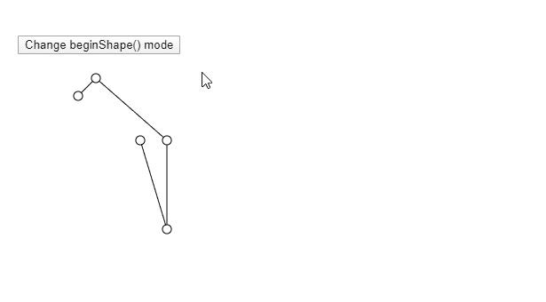
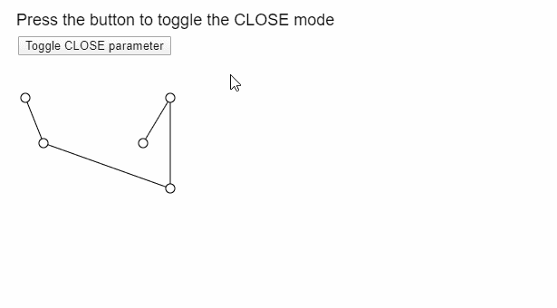

# p5.js | endShape()函数

> 原文:[https://www.geeksforgeeks.org/p5-js-endshape-function/](https://www.geeksforgeeks.org/p5-js-endshape-function/)

p5.js 中的 **endShape()函数**在 **beginShape()** 函数之后使用，完成形状的绘制。当调用该函数时，在前面的 **beginShape()** 函数之后定义的所有图像数据被写入图像缓冲区，以用作形状。

有一个可选的模式参数可以定义为使用“关闭”模式。此模式有助于在结束形状之前将其关闭。

**语法:**

```
endShape( [mode] )
```

**参数:**该函数接受一个参数，如上所述，如下所述:

*   **模式:**是一个常数，可以用来改变功能的模式。它可以有一个值 CLOSE。这是用来关闭形状的，也就是连接形状的开始到结束。这是一个可选参数。

下面的例子说明了 p5.js 中的 **endShape()函数**:

**例 1:**

```
let currMode;

function setup() {
  createCanvas(600, 300);
  textSize(18);

  let shapeModes = [
    LINES,
    TRIANGLES,
    TRIANGLE_FAN,
    TRIANGLE_STRIP,
    QUADS
  ];
  let index = 0;
  currMode = shapeModes[index];

  let closeBtn = createButton("Change beginShape() mode");
  closeBtn.position(20, 40);
  closeBtn.mouseClicked(() => {
    if (index < shapeModes.length) index++;
    else index = 0;
    currMode = shapeModes[index];
  });
}

function draw() {
  clear();

  // Starting the shape using beginShape()
  beginShape(currMode);
  vertex(80, 100);
  vertex(100, 80);
  vertex(180, 150);
  vertex(180, 250);
  vertex(150, 150);

  // Ending the shape using endShape()
  endShape();

  // Points
  circle(80, 100, 10);
  circle(100, 80, 10);
  circle(180, 150, 10);
  circle(180, 250, 10);
  circle(150, 150, 10);
}
```

**输出:**



**例 2:**

```
let isUsingClose = false;

function setup() {
  createCanvas(400, 300);
  textSize(18);

  let closeBtn = createButton("Toggle CLOSE parameter");
  closeBtn.position(20, 40);
  closeBtn.mouseClicked(() => (isUsingClose = !isUsingClose));
}

function draw() {
  clear();

  text("Press the button to toggle the CLOSE mode", 10, 20);

  beginShape();
  vertex(20, 100);
  vertex(40, 150);
  vertex(180, 200);
  vertex(180, 100);
  vertex(150, 150);

  // Use the CLOSE mode if it is enabled
  if (isUsingClose) endShape(CLOSE);
  else endShape();

  // Show the vertices
  circle(20, 100, 10);
  circle(40, 150, 10);
  circle(180, 200, 10);
  circle(180, 100, 10);
  circle(150, 150, 10);
}
```

**输出:**



**在线编辑:**[https://editor.p5js.org/](https://editor.p5js.org/)

**环境设置:**

**参考:**T2】https://p5js.org/reference/#/p5/endShape