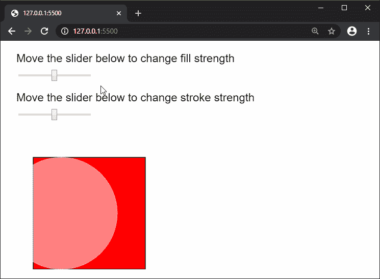
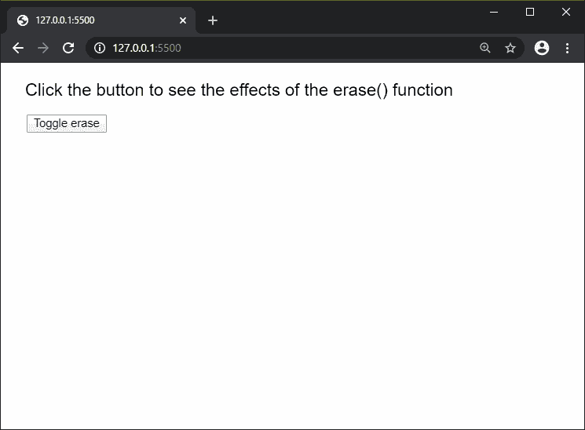

# p5.js | erase()功能

> 原文:[https://www.geeksforgeeks.org/p5-js-erase-function/](https://www.geeksforgeeks.org/p5-js-erase-function/)

p5.js 中的**擦除()功能**用于减去使用该功能后将要完成的所有绘图。减去的绘图区域将显示画布下方的网页。使用 noErase()函数可以取消该函数的效果。

它不影响由 image()和 background()函数完成的绘图。

**语法:**

```
erase( [strengthFill], [strengthStroke] )
```

**参数:**该函数接受两个参数，如上所述，如下所述。

*   **强度填充:**它是 0 到 255 范围内的一个数字，表示擦除形状的填充强度。它是一个可选值。默认值为 255，表示形状填充的全部强度。
*   **强度笔画:**是 0 到 255 范围内的数字，表示擦除形状笔画的强度。它是一个可选值。默认值为 255，表示形状笔划的全部强度。

以下示例说明了 p5.js 中的**擦除()功能**:

**例 1:**

```
function setup() {
  createCanvas(600, 400);
  textSize(20);

  fill('black');
  text("Move the slider below to change fill strength", 20, 30);

  fillStrengthSlider = createSlider(0, 255, 128, 1);
  fillStrengthSlider.position(30, 50);

  text("Move the slider below to change stroke strength", 20, 100);

  strokeStrengthSlider = createSlider(0, 255, 128, 1);
  strokeStrengthSlider.position(30, 120);
}

function draw() {
  fill('red');
  rect(50, 200, 200, 200);

  erase(fillStrengthSlider.value(), strokeStrengthSlider.value());
  circle(100, 300, 200);
  noErase();

}
```

**输出:**


**例 2:**

```
let eraseEnable = false;

function setup() {
  createCanvas(600, 400);
  textSize(20);

  fill('black');
  text("Click the button to see the effects of"
         + " the erase() function", 20, 30);

  toggleBtn = createButton("Toggle erase");
  toggleBtn.position(30, 60);
  toggleBtn.mouseClicked(toggleErase);
}

function toggleErase() {
  if (eraseEnable) {
    noErase();
    eraseEnable = false;
  }
  else {
    erase();
    eraseEnable = true;
  }
}

function mouseMoved() {
  fill('red');
  noStroke();
  circle(mouseX, mouseY, 50);
}
```

**输出:**


**环境设置:**

**参考:**T2】https://p5js.org/reference/#/p5/erase