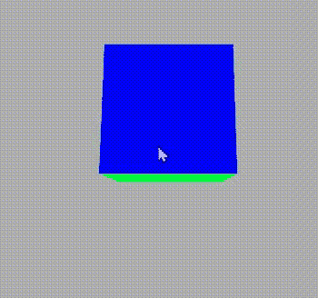

# p5.js exitPointerLock()函数

> 原文:[https://www . geesforgeks . org/P5-js-exitpointerlock-function/](https://www.geeksforgeeks.org/p5-js-exitpointerlock-function/)

功能**退出指针锁定()**退出以前使用的指针锁定，例如，如果指针被锁定，则它解锁指针，反之亦然。它用于退出由 requestPointer()函数调用的指针锁。

**语法:**

```
exitPointerLock()
```

**第一步:**打开 P5 . js https://editor.p5js.org/的网页编辑器

**第二步:**写下面的代码，看看结果。

**示例:**

## java 描述语言

```
// Make a boolean variable and set
// its value false
let lock = false;

// Set the function
function setup() {

    // Set the frame rate
    frameRate(5);

    // Set the canvas size
    createCanvas(600, 400, WEBGL);
}

// Set the draw function
function draw() {

    // Set the background colour
    background(175);

    // Set the camera
    let cX = random(-10, 10);
    let cY = random(-10, 10);
    let cZ = random(-10, 10);

    camera(cX, cY,
        cZ + (height / 2) / tan(PI / 6),
        cX, 0, 0, 0, 1, 0);

    ambientLight(255);

    rotateX(-movedX * 0.1);
    rotateY(movedY * 0.1);

    noStroke();
    normalMaterial();

    box(100, 100, 100);
}

// Function to apply exitpointer lock
function mouseReleased() {

    // If lock is not false then
    // make it true
    if (!lock) {
        lock = true;

        // Request for pointer lock
        requestPointerLock();
    } else {

        // Exit the pointer lock
        exitPointerLock();

        // Again make te lock variable false
        lock = false;
    }
}
```

**输出**:



在输出中，我们可以看到，当鼠标被释放时，它会退出上一个指针锁，因为我们已经设置了 mouseReleased()函数来退出指针锁。