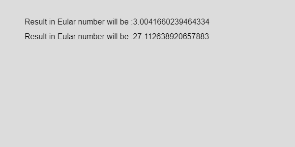
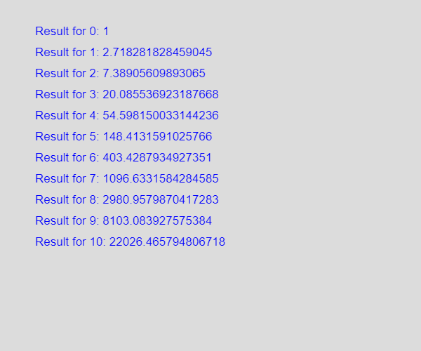

# p5.js exp()方法

> 原文:[https://www.geeksforgeeks.org/p5-js-exp-method/](https://www.geeksforgeeks.org/p5-js-exp-method/)

exp()函数将 n(任意数)的值返回到欧拉数 e(2.71828…)的幂 n (e^n).

**语法:**

```
exp(n)
```

**参数:**该方法接受单个参数 **n** 即数值。

**返回值:**返回给定数字的(e^n)。

**例 1:**

## java 描述语言

```
function setup() { 

    // Create Canvas of size 270*80 
    createCanvas(600, 300); 
} 

function draw() { 

    // Set the background color 
    background(220); 

    // Initialize the parameter and 
    // return the value of the function
    let n = exp(1.1)
    let m = exp(3.3)

    // Set the size of text 
    textSize(16); 

    text( "Result in Eular number will be :" + n, 50, 50);
    text( "Result in Eular number will be :" + m, 50, 80);

}
```

**输出:**


**例 2:**

## java 描述语言

```
function setup() { 

    // Create Canvas of size 270*80 
    createCanvas(600, 500); 
} 

function draw() { 
    let x, m;
    let step = 50

    // Set the background color 
    background(220); 

    // Initialize the parameter and return
    // the value of the function
    // For loop is set from numbert 0 to 10.
    for( x = 0; x <= 10; x++) {

        // The return value of exp() function
        m = exp(x)
        text( "Result for " + x + 
             ": " + m, 50, step);

        step = step + 30;
      }

      // Set the size of text 
      textSize(17); 

      // Set the text color 
      fill(color('blue')); 
}
```

**输出:**


**参考:**T2】https://p5js.org/reference/#/p5/exp