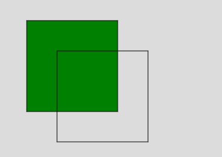
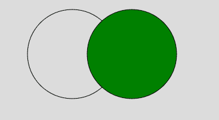

# p5.js | fill()函数

> 原文:[https://www.geeksforgeeks.org/p5-js-fill-function/](https://www.geeksforgeeks.org/p5-js-fill-function/)

**填充()功能**用于给形状填充颜色。该功能支持所有类型的颜色对象。例如 RGB，RGBA，十六进制 CSS 颜色，以及所有命名的颜色字符串。颜色对象也可以根据 RGB、RGBA、十六进制 CSS 颜色或命名颜色字符串设置为字符串。

**语法:**

```
fill( v1, v2, v3, alpha )
```

或者

```
fill( value )
```

或者

```
fill( gray, alpha )
```

或者

```
fill( values )
```

或者

```
fill( color )
```

**参数:**

*   **v1:** 用于设置相对于当前颜色范围的红色或色相值。
*   **v2:** 用于设置相对于当前颜色范围的绿色或饱和度值。
*   **v3:** 用于设置相对于当前颜色范围的蓝色或亮度值。
*   **alpha:** 用于设置图形的透明度。
*   **值:**用于设置颜色串的值。
*   **灰色:**用于设置灰度值。
*   **值:**是包含红、绿、蓝、阿尔法值的数组。
*   **颜色:**用于设置笔画颜色。

下面的例子说明了 p5.js 中的 fill()函数:

**例 1:**

```
function setup() { 

    // Create Canvas of given size 
    createCanvas(400, 300); 
} 

function draw() { 

    // Set the background color 
    background(220); 

    // Use fill() function to fill color
    fill('green')
    // Draw a line 
    rect(50, 50, 150, 150); 

    // Use noFill() function
    noFill();

    // Draw a line 
    rect(100, 100, 150, 150); 
} 
```

**输出:**


**例 2:**

```
function setup() { 

    // Create Canvas of given size 
    createCanvas(400, 300); 
} 

function draw() { 

    // Set the background color 
    background(220); 

    // Use noFill() function
    noFill();

    // Draw a circle 
    circle(140, 100, 150);

    // Use fill() function to fill color
    fill('green');

    // Draw a crrcle 
    circle(240, 100, 150); 
} 
```

**输出:**


**参考:**T2】https://p5js.org/reference/#/p5/fill