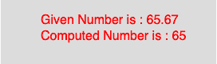

# p5.js | floor()功能

> 原文:[https://www.geeksforgeeks.org/p5-js-floor-function/](https://www.geeksforgeeks.org/p5-js-floor-function/)

p5.js 中的 **floor()函数**用于*计算一个数字*的 floor 值。该函数映射到 javascript 的**数学. floor()** 。它计算小于或等于参数值的**最接近 int** 值。

**语法**

```
floor(number)

```

**参数:**该函数只接受一个参数，如上所述，如下所述:

*   **number** : This parameter stores the number to compute.

    下面程序举例说明了**楼层()功能【p5.js 中的 T1:
    T3】示例:**

    ```
    function setup() {

        //create Canvas of size 270*80  
        createCanvas(270, 80);
    }

    function draw() {
        background(220);
        //initialize the parameter  
        let x = 65.67;
        //call to floor() function  
        let y = floor(x);
        textSize(16);
        fill(color('red'));
        text("Given Number is : " + x, 50, 30);
        text("Computed Number is : " + y, 50, 50);
    }
    ```

    **输出:**
    

    **参考:**T2】https://p5js.org/reference/#/p5/floor