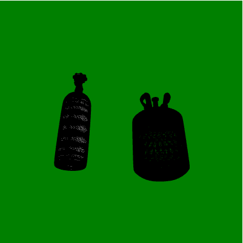
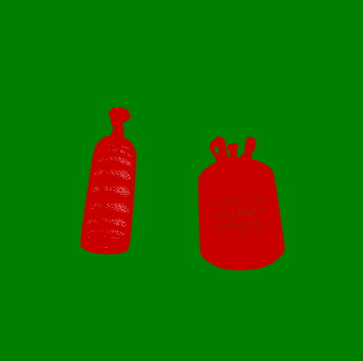

# p5.js 聚焦变量

> 原文:[https://www.geeksforgeeks.org/p5-js-focused-variable/](https://www.geeksforgeeks.org/p5-js-focused-variable/)

p5.js 中的**聚焦**变量用于检查当前窗口或草图是否聚焦。当草图聚焦时，聚焦变量将有一个真值，否则它将是假的。它类似于 CSS 中的 focus 属性。在 p5.js 中，这个变量只给出主窗口或草图的信息。如果用户更改标签或点击检查窗口，它会将变量设置为 false。

**语法**:

```
focused
```

下面的程序说明了 p5.js 中的焦点变量:

**例 1:**

## java 描述语言

```
let img;

function preload(){
  img = loadImage("gfg.png");
}

function setup() {
  createCanvas(400, 400);
}

function draw() {
  background('green');

  image(img, width/2 - img.width/2,
        height/2 - img.height/2);

  // Check if the sketch is currently
  // not focused
  if (!focused) {

      // Draw lines if the sketch 
    // is not focused
    stroke(200, 0, 0);
    line(0, 0, height, height);
    line(height, 0, 0, height);
  }
}
```

**输出:**

*   当草图聚焦时。

    

*   当草图没有聚焦时。

    

**例 2:**

## java 描述语言

```
let cylinder;
function preload() {

  // Load the model
  cylinder = loadModel('/cylinder.stl', true);
}

function setup() {

  createCanvas(400, 400, WEBGL);
}

function draw() {
  background('green');

  // Rotate the model
  rotateX(90);

  // Check if the sketch is
  // not focused
  if (!focused) {

    // Use stroke of red color
    stroke(200, 0, 0);
  } else {
    // Else use stroke of black color
    stroke(0);
  }

  // Display the model
  model(cylinder);
}
```

**输出:**

*   当草图聚焦时。

    

*   当草图没有聚焦时。

    

**参考:**T2】https://p5js.org/reference/#/p5/focused