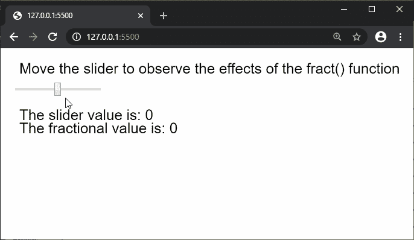

# p5.js | fract()功能

> 原文:[https://www.geeksforgeeks.org/p5-js-fract-function/](https://www.geeksforgeeks.org/p5-js-fract-function/)

p5.js 中的 **fract()函数**用来求一个数的小数部分。它在数学上可以表示为{x}，其中' x '是数字。

**语法:**

```
fract( num )
```

**参数:**该功能接受单个参数，如上所述，如下所述。

*   **num:** 这是一个要找出小数部分的数。

**返回值:**返回给定数字的小数部分。

下面的例子说明了 p5.js 中的 **fract()函数**:

**示例:**

```
function setup() {
  createCanvas(600, 200);
  textSize(22);

  text("Move the slider to observe the effects"+
       " of the fract() function", 20, 30);

  sliderElem = createSlider(-5, 5, 0, 0.0001);
  sliderElem.position(20, 50);
}

function draw() {
  clear();
  text("Move the slider to observe the"+
       " effects of the fract() function", 20, 30);

  sliderVal = sliderElem.value();

  // Find the fractional part of the number
  fractionalVal = fract(sliderVal);

  text("The slider value is: " + sliderVal, 20, 100);
  text("The fractional value is: " + fractionalVal, 20, 120);
}
```

**输出:**



**在线编辑:**[https://editor.p5js.org/](https://editor.p5js.org/)

**环境设置:**

**参考:**T2】https://p5js.org/reference/#/p5/fract