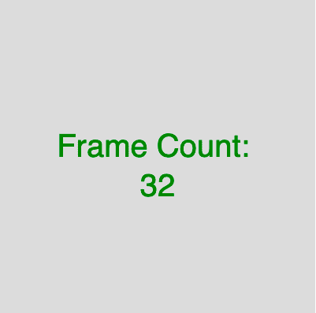

# p5.js | frameCount 变量

> 原文:[https://www.geeksforgeeks.org/p5-js-framecount-variable/](https://www.geeksforgeeks.org/p5-js-framecount-variable/)

p5.js 中的**帧数变量**用于保存程序启动后显示的帧数。在 setup()函数中，该值为 0，在 draw 的第一次迭代后，该值为 1，以此类推。

**语法:**

```
frameCount
```

下面的程序说明了 p5.js 中的框架计数变量:

**示例:**本示例使用 frameCount 变量显示帧数。

```
function setup() {

    // Create canvas of given size
    createCanvas(400, 400);

    // Set text size to 40px
    textSize(40); 

    // Align text to center 
    textAlign(CENTER);

    // Set Frame Rate to 0.5  
    frameRate(0.5);
}

function draw() {

    // Set background color
    background(220);

    // Set color of text
    fill('green');

    // Use frameCount Variable
    text("Frame Count: \n" + frameCount, 
            width / 2, height / 2); 
}
```

**输出:**


**参考:**T2】https://p5js.org/reference/#/p5/frameCount