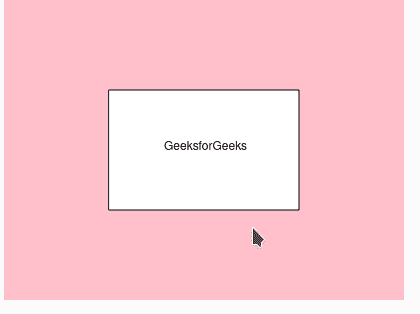

# p5.js 几何()方法

> 原文:[https://www.geeksforgeeks.org/p5-js-geometry-method/](https://www.geeksforgeeks.org/p5-js-geometry-method/)

p5。Geometry()方法用于表示 3d 对象。它由 **loadModel()** 函数返回，也由三维图元绘制函数在内部使用。

这个函数需要 p5.dom 库。所以在**文件的头部增加以下一行。**

## **java 描述语言**

```
<script language="javascript" 
    type="text/javascript" src="path/to/p5.dom.js">
</script>
```

****语法:****

```
new p5.Geometry([detailX], [detailY], [callback])
```

****参数:detailX** 和 **detailY** 取水平面上的顶点数，**回调**取一个函数调用对象实例化。**

****P5 中可用的方法。几何类:****

<figure class="table"> **| 

Sr 编号

 | 

方法

 | 

描述

 |
| --- | --- | --- |
| 

1。

 | computeffaces()

 | 它用于根据顶点计算几何对象的面。 |
| 

2。

 | computeNormals() | 它用来计算每个顶点的平滑法线作为每个面的平均值。 |
| 

3。

 | average normals() | 它用于曲面计算顶点法线的平均值。 |
| 

4。

 | average pole normals() | 它在球面基元中用来计算平均极法线。

 |
| 

5。

 | normalize() | 它会将所有顶点修改为在-100 到 100 范围内居中。 |** </figure>

****示例:****

## **java 描述语言**

```
function setup() { 

    // Create Canvas of given size 
    var cvs = createCanvas(400, 300);
}

function draw() {

  // Set the background color
  background('pink'); 

  // Creating rectangle at center of canvas
  rectMode(CENTER);

  // Initializing a rect geometry 
  geo = new p5.Geometry(
    rect(200,150,190,120)
  );

  // Adding text to the geometry figure
  text('GeeksforGeeks', 160, 150);
}
```

*   **在**新增 p5。几何(rect(200，150，190，120))，** 200 用于指定 x 轴，150 用于 y 轴，190 是矩形的宽度，120 是矩形的高度。**
*   **类似地，在文本中，160 是相对于画布屏幕的 x 轴位置，150 是 y 轴位置。**

****输出:****

****

****参考:**T2】https://p5js.org/reference/#/p5.Geometry**